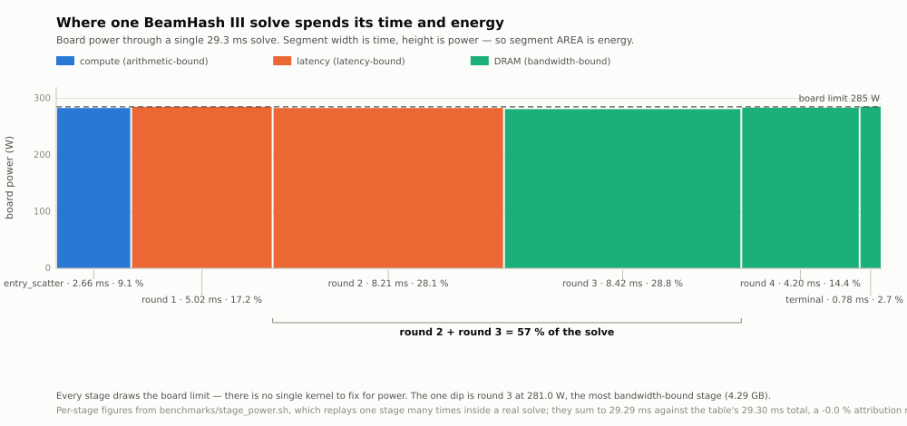

# Benchmark results

Measured numbers for MXBM, and for lolMiner on the same card, so the comparison is
like-for-like. Everything here is reproducible with the scripts in `benchmarks/` — the
commands are given under each table.

**MXBM has been measured on four GPUs**: an RTX 4070 Ti SUPER (the card everything is
developed against), an M3 Max via Metal, and a contributed RTX 4070 SUPER and RTX 3060 Ti.
See [benchmarked devices](#benchmarked-devices), and [send us yours](#send-us-your-numbers).

For *why* comparing miners is harder than reading two numbers off two screens, see
[benchmarking.md](benchmarking.md). This page is the results; that page is the method.

---

## Reference card

| | |
|---|---|
| GPU | NVIDIA GeForce RTX 4070 Ti SUPER (Ada, sm_89, 66 SMs) |
| VRAM | 16 GiB GDDR6X, 10251 MHz, 256-bit (**656 GB/s peak at that rung**, ~510 GB/s achievable) |
| Board power limit | 285 W default, 100–366 W permitted by the driver |
| Driver | 610.43.03 · CUDA 13.3 |
| OS | Linux 7.1.4 (Arch) |

All figures below are on this card at **stock clocks**, no overclock or undervolt, unless
the row says otherwise.

---

## MXBM vs lolMiner 1.98a

Both mining BeamHash III against `de.beam.herominers.com:1130` over TLS, stock settings.

| | MXBM (CUDA) | lolMiner 1.98a | |
|---|---|---|---|
| Throughput | **62.3 sol/s** | 53.27 sol/s | **+17 %** |
| Board power | 281.4 W | 238.7 W | +18 % |
| Efficiency | 0.221 sol/s/W | **0.223 sol/s/W** | −1 % |
| Core clock | 2610 MHz | 2745 MHz | |
| Memory clock | 10251 MHz | 10251 MHz | |
| Temperature | 67 °C | 60 °C | |
| VRAM for a full search | 6.17 GiB[^4g] | ~4 GiB | |

MXBM's column is the 2026-08-13 build: 80 minutes against the pool reads
**62.32 sol/s**, its 15 s windows spread σ = 1.99 (a spread of the reading — the
uncertainty on that mean is ±0.11), and the controlled benchmark the same day
reads **62.7 sol/s at 32.0 ms/solve** (six 120 s runs, 0.0 % spread). **That column
predates the w0-checkpoint record and the replayed recovery**, which together took the
controlled figure to **69.20 sol/s at 29.10 ms** on 2026-08-16 (+10.4 %); the table is left
at what was actually measured side by side rather than restated from a figure the
head-to-head session never ran, so read every margin in it as a floor on the current
one. lolMiner's
column is the 2026-07 head-to-head session; its binary is unchanged.

**Read that efficiency row carefully — it compares two different operating points.** MXBM
runs pinned at the card's 285 W board limit in every kernel (verified: the driver reports
`sw_power_cap` active, at 67 °C, so it is a power ceiling and not a thermal
one). lolMiner draws 239 W and is *not* capped — it leaves 46 W unused. Comparing sol/s/W
at stock therefore rewards whichever miner fails to fill the card.

At **equal power** the ranking reverses, but only inside a window. Both miners capped
to 220 W:

| | MXBM at 220 W | lolMiner at 220 W | |
|---|---|---|---|
| Throughput | **65.8 sol/s** | 54.35 sol/s | **+21.1 %** |
| Board power | 219.7 W | 219.4 W | — |
| Efficiency | **0.2995 sol/s/W** | 0.2477 sol/s/W | **+20.9 %** |

MXBM is ahead on both from roughly **181 W to the 285 W stock limit**. Below that
lolMiner is ahead on both — at 180 W by about 0.5 %, peaking at 8 % around 140 W and
gone by the 100 W floor, where the two are level. The upper crossing at ~277 W closed with
the w0-checkpoint record: MXBM is now ahead on efficiency at 285 W too, 0.2448 against
0.2260.

**Both curves are measured.** lolMiner was swept across the same caps as MXBM rather than
sampled once at its own uncapped draw, which is what makes the window above a comparison
of two curves instead of a curve against a point. Capping lolMiner improves its efficiency
substantially, and that is already priced into the numbers above.

**What this does not show.** The two miners' `sol/s` are separate counters whose
relationship is [an open question](benchmarking.md#1-the-problem-with-comparing-reported-sols)
— MXBM reports CPU-verified solutions and lolMiner's basis is undocumented, a distinction
worth ~17 % inside our own pipeline. The watts are trustworthy across miners because one
instrument measured both; the sol/s columns are each miner against itself. Accepted pool
shares over a fixed interval remain the only arbiter that needs neither counter.

[^4g]: at the fastest geometry, which is what both miners run here. lolMiner selects
"BeamHash III **4G** (CUDA)" on this card; MXBM's own floor is 1.90 GiB on a card that
cannot host the fast rung, which is a class below the 4 GB one — see
[HW_REQUIREMENTS.md](HW_REQUIREMENTS.md#the-design-target-is-met).

---

## MXBM power curve

The board power limit is the most valuable setting on this card, because MXBM is pinned
against it. Measured with `benchmarks/power_sweep.sh`, 90 s per point:

| `--pl` | sol/s | ms/solve | measured | core clock | sol/s/W | J/solution |
|---|---|---|---|---|---|---|
| 180 W | 45.2 | 44.6 | 180.2 W | 1905 MHz | 0.2508 | 3.99 |
| 200 W | 50.6 | 39.6 | 199.8 W | 2220 MHz | **0.2533** | **3.95** |
| **220 W** | **53.8** | 37.2 | 219.6 W | 2460 MHz | 0.2450 | 4.08 |
| 240 W | 55.2 | 36.3 | 239.5 W | 2550 MHz | 0.2305 | 4.34 |
| 255 W | 56.3 | 35.6 | 254.4 W | 2625 MHz | 0.2213 | 4.52 |
| 270 W | 57.1 | 35.1 | 269.2 W | 2670 MHz | 0.2121 | 4.71 |
| 285 W *(stock)* | **57.5** | **34.8** | 284.1 W | 2700 MHz | 0.2024 | 4.94 |

**Both miners have a `--pl`, and the honest comparison sweeps both.** The table above is
MXBM's curve alone; lolMiner was only ever measured uncapped, which turned out to matter
a great deal. Swept against each other at identical caps:


**Where each one wins.** Between ~101 W and ~181 W lolMiner is ahead on speed *and*
efficiency, by about 0.5 % at 180 W. From ~181 W to the 285 W stock limit MXBM is ahead on
both, by 21 % at 220 W and 25 % at 240 W. The upper crossing at ~277 W closed with the
w0-checkpoint record.
lolMiner barely responds to a cap at all — it gives up 2.4 % of its speed for 24 % less
power, and above ~237 W the cap does nothing. Its best efficiency (0.2991 sol/s/W at
175 W) is now met: MXBM's best is **0.3009 sol/s/W at 210 W on stock memory** —
3.324 J/solution — **0.6 % ahead**, where it was 0.8 % behind on the previous kernel,
8.9 % the one before and 15.4 % the one before that, and at that point MXBM does 63.1
sol/s against 52.25. Treat 0.6 % as a tie, not a lead.
What MXBM has is the ceiling: 69.6 sol/s against ~54.0, which lolMiner cannot reach at
any setting.

The July sweep was run twice, two days apart, and **reproduced within ~1 %** at every
cap, so the crossings are a property of the two miners, not of the day. The MXBM
column was swept end to end 2026-08-15 on the current build — the window widened because
the build got faster, not because the rig moved.
It now runs down to the card's **100 W floor**, which settles the question of whether
lolMiner had a better efficiency point hiding below the old 120 W left edge: it does not.
Both curves fall away monotonically below their peak.

Full numbers, the mechanism (we lose 570 MHz of core clock to it at 180 W) and what it
implies for the roadmap are in
[performance.md](performance.md#both-miners-under-the-same-cap). Reproduce with
`benchmarks/compare_power.sh`; the chart is generated from that table by
`python3 docs/tools/plot_power.py`.

Each point is 90 s (~2,000–2,500 solves). At that sample size the solutions-per-solve
factor reads 2.01 where an 8,500-solve run measures 1.99, so **the sol/s column is
about 1 % high in absolute terms** — stock read 57.5 here and 56.4 over a long run
(both on the build of 2026-07-25; the current one is 69.20).
Every point was measured the same way, so the curve's shape, its peak and the crossings
against lolMiner are unaffected. Left as measured rather than rescaled to numbers nobody
observed.

Two things worth knowing before you cap your own card:

- **Efficiency peaks at 220 W and gets *worse* below it.** At 180 W the core clock has
  fallen to 1725 MHz and the parts of the board that do not scale with it — memory,
  uncore, leakage — are being paid for out of less work. Lower is not always better, and
  the head-to-head sweep shows this holds all the way down to the card's 100 W floor.
- **The last watts are the worst value.** Going 220 → 285 W buys 3.8 sol/s for 65 W; the
  20 W from 190 to 210 buys 7.1. Where to sit is an economic choice about your power
  price, not a technical one.

```sh
sudo mxbm --algo BEAM-III --pool ... --user ... --pl 210
```

`--pl` needs root. Without it MXBM says so by name and mines on at the card's current
limit. The previous limit is restored on exit, including on Ctrl+C. See
[usage.md](usage.md#power-limit).

---

## At the other end: the memory V/F offset

The low rung below is what a *capped* rig wants. An uncapped one wants the opposite knob.
Rounds 3 and 4 are 45 % of the solve at 77.4 % and 88.6 % of DRAM peak, so the memory
clock is the only knob on the resource that binds them — and on the reference card there
is headroom above the 10251 MHz it holds under load.

**Take it with `--moff`, not `--mclk`.** Locking to the driver's reported 10501 maximum
measures **+0.95 % slower**, because a locked P-state buys its clock with voltage and the
board is already at its power limit, so the watts come out of a solve that is 54 %
core-bound. The offset shifts the V/F curve instead. Bracketed `A B B A`, 12 arms of 40 s,
headless, drop counters zero and verified solutions/solve in band on both arms:

| | ms/solve | range | J/sol | sol/s |
|---|---|---|---|---|
| stock memory | 28.733 | 28.711 – 28.760 | 4.090 | 69.8 |
| `--moff 1600` (11051 MHz) | **28.050** | 28.027 – 28.066 | **4.008** | **71.5** |

**−2.37 % time and −2.00 % energy**, ranges separated by 0.645 ms. Both figures at once,
because the board is pinned at its limit: power is constant, so the energy win *is* the
speed win.

The sweep behind that point ran monotone to +2400 (11451 MHz) without reversing, but the
gain stops tracking the clock: a two-clock model predicts the measurement to 101 % and
97 % through +1400, then 80 % at +1600 and 71 % at +2200. That is the retry wall arriving
gradually, so +1600 is where the returns bend rather than where they stop.
[The mechanism](performance-research.md#locking-the-memory-clock-to-its-reported-maximum-costs-095--and-the-offset-is-the-knob-that-does-not);
[how to find your own](overclocking.md#finding-your-own-memory-offset).

**This figure is excluded from every comparison in this document,** and not only as
methodology: MXBM moves 12.30 GB a solve where a state-storing design moves 17.67, so the
same clock is worth more to the miner that stores. An overclocked head-to-head measures
the overclock.

---

## Capped rigs: the memory rung and the low-power kernels

The curve above is stock memory. Under a cap that is the wrong configuration: the memory
clock does not scale with the core, so the interface burns a fixed slice of a small budget
for bandwidth nothing is using. Dropping it to the **5001 MHz rung** returns those watts as
core clock, and below ~130 W MXBM also switches to a different geometry and rebuild
variant. Together that is MXBM's best configuration at each cap.

Measured 2026-08-16 on the current build, headless, `power_sweep.sh` under
`-lmc 5001,5001` run forward and then reversed (arms agree to 2.9 % at 100 W, 0.0–1.1 %
elsewhere; the table is their mean):

| cap | ms/solve | sol/s | J/solution | sol/s/W | vs stock memory | lolMiner at its own best |
|---|---|---|---|---|---|---|
| 100 W | 73.1 | 27.2 | 3.674 | 0.272 | +20.4 % | 28.85 sol/s |
| 120 W | 57.2 | 35.1 | 3.419 | 0.293 | +13.2 % | 34.05 |
| 140 W | 49.4 | 40.8 | 3.434 | 0.291 | +12.4 % | 39.75 |
| **160 W** | 42.5 | **47.4** | **3.368** | **0.297** | +8.2 % | 47.85 |

**Take the rung only if you are hard-limited to ~160 W or below.** It is worth +6 % at
160 W rising to +17 % at 100 W — and with each miner at its own best configuration MXBM
now *leads* the band at 120 and 140 W, ties at 160, and trails only at the 100 W floor.
What it is not is an efficiency setting: 3.368 J/solution at 160 W against 210 W's 3.324
on stock memory, and at that point stock does **63.1 sol/s against 47.4** — 33 % more
work for less energy per solution.

The rung's margin over stock memory is a floor rather than a measurement: the 2026-07-31
ABBA read +16.7/+16.8/+12.1/+9.3 % across these caps and against the current stock column
it reads +17.2/+11.4/+9.4/+5.8 %, but the rung has not been re-swept since the singleton
filter shipped and stock has. The mechanism, the A/Bs behind each step and lolMiner's own
rung sweep are in
[performance.md](performance.md#below-stock-the-other-rung-pays-8-to-20--under-caps-below-165-w).

```sh
sudo mxbm --algo BEAM-III --pool ... --user ... --pl 160 --mclk 5001
```

Both settings are restored on exit. Above ~165 W the rung is a wall — do not use it there.

---

## Where the time and energy go

Per solve, from `benchmarks/stage_power.sh` (which replays one stage many times inside a
real solve and solves for its own time and power) and from Nsight Compute:



The chart is the table below, drawn as a timeline: width is time, height is power, so
each block's **area** is the energy that stage costs. Generated from the table by
`python3 docs/tools/plot_stages.py`, so the two cannot drift.

Re-measured 2026-08-16 on the current kernels, 8 reps, 45 s per stage, baseline
29.23 ms/solve, drops 0:

| stage | ms | % of solve | power | DRAM traffic | bound by |
|---|---|---|---|---|---|
| `entry_scatter` | 2.66 | 9.1 % | 282.9 W | 0.27 GB | compute (SipHash) |
| round 1 | 5.02 | 17.2 % | 285.1 W | 0.81 GB | latency |
| round 2 | 8.21 | 28.1 % | 282.8 W | 2.68 GB | latency |
| round 3 | 8.42 | 28.8 % | **281.0 W** | 4.29 GB | **DRAM** |
| round 4 | 4.20 | 14.4 % | 283.5 W | 2.42 GB | **DRAM** |
| terminal | 0.78 | 2.7 % | 285.3 W | 0.27 GB | DRAM |
| **total** | **29.30** | 100.2 % | 282.8 W | **10.73 GB** | |

**Scope: this table predates the day's two kernel changes** (the block-exit barrier and
singleton-free staging, −0.20 ms together on the pin, both landing in rounds 1 and 2).
It is the 29.30 ms build's breakdown, not the 29.10 one's; the per-stage split has not
been re-taken with power and `benchmarks/stage_power.sh` is what re-takes it. The *time*
split has been, by a second instrument that cannot give the power column —
[the idle-GPU census](performance-research.md#the-gpu-computes-993--of-a-solve) reads
per-kernel durations straight out of Nsight Compute. Round 3 and the terminal round agree
to ~1 %; rounds 1 and 2 read 4.79 and 7.94, which is where the −0.20 ms landed. It also
shows why `entry_scatter` has no dispatch of its own at stock: speculative entry carries
it inside round 4's launch, and the pair costs 6.39 ms against the 6.86 these two rows sum
to when replayed apart.

Deleting the reference rows is visible here as its own mechanism: **round 4 −1.21 ms**
(its row and half its output record), **round 3 −0.54**, **round 2 −0.29**, **round 1
−0.14**, **terminal −0.20**, and entry unmoved. Round 4 carries more than half the win
because it lost the most: a row for every child *and* a record that went 16 B to 8. The
DRAM column falls 12.30 → 10.73 GB, all of it the four rows (0.27 GB each) plus round
4's narrowed record on both the write and the terminal's read; it is the compulsory figure
from the stride table, which the previous kernel's Nsight measurement matched to 0.7 %.

The stage sum runs 0.2 % over the baseline it is measured against, so read the per-stage
deltas as attribution and the interleaved **−2.029 ms** as the number.

Every stage draws the board limit, which is why there is no single kernel to "fix" for
power. Total DRAM traffic is within **0.7 %** of the compulsory minimum for the record
widths — there is no waste to reclaim, only records to narrow, which is the same problem
as the footprint. Full analysis in
[performance.md](performance.md#power-and-efficiency).

Note what "compulsory" does and does not claim: it fixes the **byte count**, not the rate
those bytes move at. Narrowing this path is priced in memory instructions and sectors,
never in bytes — halving round 3's write sectors buys 4 % of the round, an implied
~3000 GB/s against a 656 GB/s bus. See
[the dead word](performance-research.md#round-3-stores-a-work-word-round-4-never-reads--worth-268-mb-and-nothing-in-time).

---

## Reproducing any of this

Build first — see [building.md](building.md).

| What | Command | Needs root |
|---|---|---|
| Throughput (and the A/B number for a CUDA change) | `mxbm --benchmark BEAM-III --benchmark-seconds 120` | no |
| Throughput + power + J/sol | `benchmarks/power_bench.sh 120 myrun -- --solver cuda` | no |
| Power/speed curve | `benchmarks/power_sweep.sh` | yes (`nvidia-smi -pl`) |
| Per-stage time and power | `benchmarks/stage_power.sh` | no |
| Kernel counters (DRAM bytes, stalls) | `CLOCKS=none TARGET=miner ./cuda/profile.sh` | no, once the module option below is set |
| Pipeline A/B for a code change | `./cuda/pipeline 700` | no |
| **Correctness gate for a CUDA change** | `./build/tests/test_cuda_solver` — 3/3 goldens on 22 configurations | no |
| Any rung of the VRAM ladder, on any card | `MXBM_BB=14 MXBM_QUAD=1 MXBM_ARENA=1 mxbm --benchmark BEAM-III` | no |
| Drop counters (entry/stage/out/walk) and the arena's spill total | prefix any run with `MXBM_DROP_STATS=1` | no |
| Positive control for those counters | `MXBM_CAP_SIGMA=-6` undershoots the bucket reservation and makes `entry` fill | no |
| Positive control for the singleton filter | build at `-DMXBM_SPILL=0 -DMXBM_FCAP=64`; `drops stage` is then the staged count less a constant, and `MXBM_SOLO=0` vs `=2` differ by the elements refused | no |

Nsight needs GPU counter access, which is admin-restricted by default and lifted
permanently here by `NVreg_RestrictProfilingToAdminUsers=0` in
`/etc/modprobe.d/nvidia-profiling.conf` — check with `grep RmProfilingAdminOnly
/proc/driver/nvidia/params` (0 = unrestricted). Installing that file takes one reboot;
running the profiler afterwards takes neither root nor a reboot.

Run on an **idle GPU**. A benchmark taken while something else is using the card measures
contention, not the miner — a lolMiner run taken while MXBM was mining read 25–27 sol/s
instead of 53.

Quote a **median over several thousand solves**, not a peak. Under a few thousand, the
solutions-per-solve factor alone moves the headline by more than a sol/s — this project
published 57.5 from a 90 s run and measured 56.4 from a 300 s one, same build (2026-07-25). Individual 15 s
windows on this card reach 61.5 sol/s, and that figure is noise: for the observed spread,
the expected maximum of 304 samples is about 67. The median moves by less than 1 %
between runs; peaks move by 10 %.

---

## Apple Silicon (Metal)

The second card MXBM has been measured on. **No cross-vendor comparison is intended**:
the numbers below sit next to Ada's in this document only because there is nowhere else
to put them, and a 40-core laptop GPU at ~400 GB/s is not the same class of hardware as a
285 W desktop board.

| | |
|---|---|
| GPU | Apple M3 Max, 40 GPU cores (Apple9 family, Metal 3) |
| Memory | 128 GB unified, 107.5 GB reported as the GPU working set |
| OS | macOS 26.5, Metal toolchain 17F109 |
| Power / thermal control | none available — see below |

### Results

| | ms/solve | sol/s | |
|---|---:|---:|---|
| **MXBM (Metal, SEEDF)** | **101.5** | **18.8** | default on Apple |
| MXBM (Metal, rebuild path) | 117.8 | 16.2 | the configuration CUDA ships |
| MXBM (OpenCL, sort path) | ~505 | ~3.8 | the only OpenCL path that runs here |
| lolMiner | — | — | no Apple Silicon build exists |

Pipeline medians over 6–8 solves, cold, with the baseline bracketed either side. The
sustained miner figure over a 60 s run is **16.3 sol/s, 128.0 ms/solve median (p5 100.0,
p95 135.7)** across 491 solves — the p5 matches the pipeline figure exactly, and the gap
above it is thermal, not overhead.

**Apple's OpenCL cannot run this pipeline at all.** Both the LDS and fused row-bucket
collision finders fail at `clCreateKernel` with `CL_INVALID_KERNEL (-48)`, confining the
OpenCL path to the slowest of the three finders. Metal is not a faster dialect here; it
is the only way to run the fused algorithm on a Mac. The six OpenCL gates that cover
those kernels are marked disabled on macOS rather than silently skipped.

### Two things this platform will not tell you

- **No power figure.** macOS exposes no public API for GPU power, clocks, temperature or
  fan. `powermetrics` reads them through a private framework whose layout moves between
  OS releases, so MXBM reports utilization and nothing else rather than a number nobody
  can trust. Every efficiency claim elsewhere in this document is therefore
  Ada-only — there is no sol/s/W row here because there is no honest W.
- **No overclocking or power limiting.** `--pl`, `--cclk` and friends report
  "not supported on this platform".

### Reproducing

```sh
cmake -S . -B build -DCMAKE_BUILD_TYPE=RelWithDebInfo \
      -DOPENSSL_ROOT_DIR="$(brew --prefix openssl@3)"
cmake --build build -j

# pipeline median over 20 solves, gated on the KAT goldens
MXBM_BENCH=20 ./build/tests/test_metal_solver

# per-phase GPU time (GPUStartTime/GPUEndTime, not wall clock)
MXBM_METAL_TIMING=1 ./build/tests/test_metal_solver

# the A/B behind the SEEDF default -- no rebuild needed, both pairs are compiled in
MXBM_METAL_REBUILD=1 MXBM_BENCH=20 ./build/tests/test_metal_solver

# sustained, through the miner
./build/mxbm --benchmark BEAM-III --benchmark-seconds 60
```

Needs the Metal toolchain (`xcodebuild -downloadComponent MetalToolchain`); without it
the Metal backend is simply not built and everything else still works.

**Benchmark only on an otherwise-idle machine.** This is a laptop: a concurrent build
inflated one early measurement by 30 % and produced a figure that had to be retracted
from `performance.md`. Quote medians, bracket a sweep with the baseline repeated first
and last, and discard the run if the two brackets disagree.

---

## Send us your numbers

Everything in the Ada sections above — the geometry choices, the power curve, the record
layout, the claim that rounds 3 and 4 are bandwidth-bound — is measured at one memory
bandwidth with one shared-memory budget, and some of it does not transfer. Two cases are
already known: round 2's rebuild costs 0.4 ms on Ada and 21 ms on Apple, and the 5001 MHz
memory rung pays below 173 W on the 4070 Ti SUPER but only below 121 W on the 4070 SUPER.

Particularly wanted:

- **Anything that is not Ada** — Turing, Blackwell, A-series. (Ampere: one report so far.)
- **Smaller cards**: 8–12 GB. MXBM refuses to start below its threshold rather than mine
  nothing, so a refusal is itself a useful report — tell us what it said.
- **AMD**, via the OpenCL backend. It is completely untested there.
- **OpenCL on anything but the reference card.** Every contributed run so far chose CUDA.
- **Anything where MXBM is slower than another miner on your hardware.** That is the most
  useful report of all, and it will not offend anyone.

### One command

```sh
benchmarks/collect_report.sh
```

It runs a two-minute benchmark, samples telemetry while it runs, and prints a
paste-ready markdown block — hardware, driver, sol/s, power, efficiency. Nothing is
uploaded; it only writes to your terminal. Add the power curve with:

```sh
SWEEP=1 benchmarks/collect_report.sh      # needs sudo for nvidia-smi -pl
```

Then open an issue with the **Benchmark report** template and paste it in.

### If you would rather not run a script

Paste whatever you have. The minimum that makes a report usable:

- GPU model, VRAM, driver version, OS
- `mxbm --benchmark BEAM-III --benchmark-seconds 120` output in full
- whether anything else was using the GPU
- any overclock, undervolt or power limit applied

### What happens to it

Results get added to the benchmarked-devices table below with attribution, and hardware
that behaves
differently from the reference card becomes a work item. If MXBM turns out to be slow or
broken on your GPU, that is a bug report we want, not a disappointment to manage.

### Benchmarked devices

Each row is at the card's **stock** power cap.

| GPU | Memory | Driver / OS | Backend | sol/s | ms/solve | W | sol/s/W | Source |
|---|---|---|---|---|---|---|---|---|
| RTX 4070 Ti SUPER | 16 GiB GDDR6X | 610.43.03 · Linux | CUDA | 60.2 | 33.1 | 284 | 0.212 | ours, `--benchmark` |
| RTX 4070 Ti SUPER | 16 GiB GDDR6X | 610.43.03 · Linux | OpenCL | 59.4 | 33.5 | 284 | 0.209 | ours, `--benchmark`, same session |
| RTX 4070 SUPER | 12 GiB GDDR6X | 610.62 · Windows | CUDA | 43.9 | 44.8 | 214 | 0.205 | ZumZum, `--tune` † |
| RTX 3060 Ti | 8 GiB GDDR6 | 610.62 · Windows | CUDA | 22.4 | 88.1 | 195 | 0.115 | ZumZum, `--tune` † |
| Apple M3 Max (40-core) | 128 GB unified | macOS 26.5 · Metal 3 | Metal | 16.3 | 128.0 | — | — | ours, `--benchmark` |

† `--tune` sweep points, not `--benchmark`: 60 s, CPU-verified, warmed up and
drift-gauged. On the 4070 SUPER the miner loop reported ~48 sol/s at the same watts in
the same session, ~10 % above the sweep, and which instrument is right is
[open](performance.md#open-the-tune-harness-and-the-miner-loop-disagree). The
lower number is quoted.

The M3 Max's pipeline alone runs **101.5 ms/solve (18.8 sol/s)**; the sustained figure is
lower because a laptop throttles. It has no power column because macOS exposes no public
GPU power API — blank rather than estimated.


Curves for the three NVIDIA cards, generated from the tables in
[performance.md](performance.md#third-party-hardware--a-two-card-rig-2026-08-02). **Not a
controlled comparison** — different machines, operating systems and instruments — so
cross-card distances are unreliable. What holds is each curve's shape and where its own
efficiency peak sits: 220 W, 148 W and 130 W, all well under stock.
