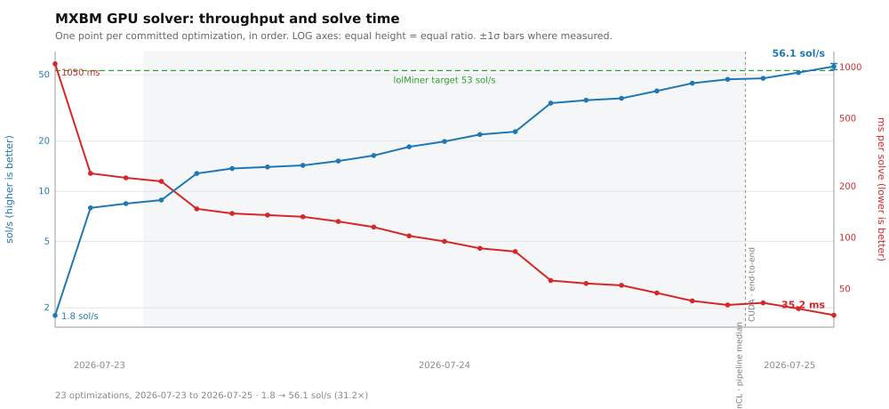
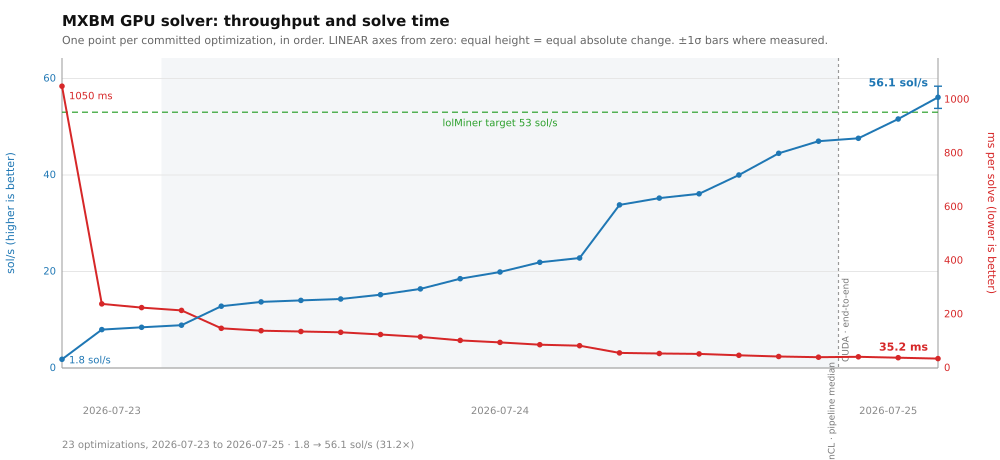

# GPU Performance

The permanent record of MXBM's GPU solver optimization: what we tried, what it
measured, and why. Every number here was produced by a committed benchmark or test
in this repository — nothing is estimated or extrapolated unless explicitly labelled.

**Target:** lolMiner does **~53 sol/s** on an RTX 4070 Ti SUPER at **stock clocks, no
special configuration** (user-measured). BeamHash III yields ~1.9 solutions per solve,
so 53 sol/s ÷ 1.9 ≈ **28 solve/s ≈ 36 ms/solve**. That is the bar.

**Reference hardware** for every measurement below: RTX 4070 Ti SUPER (Ada, sm_89,
66 CUs, 16 GB, 48 KB LDS/workgroup, ~510 GB/s achievable copy bandwidth).

**How to reproduce.** Two figures are quoted throughout, and they measure different things:

- `./build/bench_rounds 20` — median over 20 runs of the **solver pipeline** (entry through
  terminal). This is the controlled number used to make optimization decisions.
- `./build/test_gpu_solver` — **end-to-end `GpuSolver::solve()`**, including survivor
  readback, back-reference recovery and CPU verification. Take `solve #2` (steady state,
  persistent buffers); `solve #1` pays one-off allocation. This is what a miner reports,
  so it is the headline.

Both are noisy at the ~1 ms level, so single samples are not meaningful — quote a median
of at least 5. `MXBM_NO_ROWBUCKET=1` forces the fallback sort path.

sol/s ≈ 1900 / ms, since BeamHash III yields ~1.9 solutions per solve.

---

## Progress log

Times are median ms per solve, lower is better. "Worked" and "Didn't work" link to the
sections explaining each result.

Rows above the backend switch are `bench_rounds` **pipeline** medians; rows below are
**end-to-end** `solve()` medians including recovery and CPU verification. The two tracked
each other closely on OpenCL where both were measured (40.3 vs 41.0 ms), so the trend is
continuous across the switch — but the CUDA rows are the stricter measurement, not the
looser one.

The first row is the **real-world** starting point: the miner's own reported speed when
the GPU solver found its first share. Later rows are `bench_rounds` pipeline medians,
the controlled measurement used to make optimization decisions. Early on these disagreed
sharply — the pipeline benched at 245 ms (≈ 7.9 sol/s equivalent) while the miner
actually delivered ~1.8 sol/s, i.e. most of a solve was spent *outside* the measured
pipeline. That overhead is gone; bench and end-to-end now track each other.





Both charts are generated from the table below by `python3 docs/tools/plot_progress.py`
(no dependencies), so the two cannot drift — add a row, re-run it. Two things it is
deliberately explicit about:

- **The x axis is optimization step, not calendar time.** Only three dates exist and 16
  of the rows fall on one of them, so a literal date axis would collapse into three
  vertical stacks. Dates are drawn as bands instead.
- **The dashed divider is a change of measurement, not just of backend.** Everything left
  of it is a `bench_rounds` pipeline median; everything right of it is an end-to-end
  `solve()` median including recovery and CPU verification. The right-hand points are the
  stricter measurement, so the line is continuous but the two halves are not
  interchangeable.

The two scales answer different questions and neither is sufficient alone. **Log** makes
equal vertical distance mean equal *ratio*, matching the Δ % column, and is the only way
to see the early changes at all next to a 30× range. **Linear** starts both axes at zero,
so equal height means equal *absolute* change — which is what makes it obvious that
almost all of the ms won was won early, while almost all of the sol/s gained came late.
Both are true; the log chart alone would understate how flat the recent ms curve is.

Error bars are ±1σ, drawn only where a spread was actually measured — the parser reads
`56.1 ± 2.3` out of the table, so a row without a measured spread stays a bare point
rather than being given a fabricated one.

| Date | Change | Before | After | **sol/s** | Δ ms | Δ % | Worked | Didn't work |
|---|---|---|---|---|---|---|---|---|
| 2026-07-23 | **First working GPU solver** (first share found) | — | ~1050 | **1.8** | — | — | — | — |
| 2026-07-23 | Sort-based collision finder (P1–P3) | 245.0 | 239.0 | **7.95** | −6.0 | −2.4 % | [Sort path](#sort-based-collision-finder) | — |
| 2026-07-23 | Tiled 4-bit × 6-pass radix sort (P4) | 239.0 | 225.0 | **8.44** | −14.0 | −5.9 % | [Tiled radix](#tiled-radix-sort) | — |
| 2026-07-24 | Fixed-width AoS compaction `[7,7,6,5,1]` | 224.4 | 214.5 | **8.86** | −9.9 | −4.4 % | [Compaction](#fixed-width-compaction) | [SoA planes](#soa-word-planes), [runtime widths](#runtime-loop-bounds) |
| 2026-07-24 | Fused row-bucket pipeline (STEP A–C) | 215.0 | 148.0 | **12.8** | −67.0 | −31.2 % | [Row-bucket](#fused-row-bucket-pipeline) | [Un-fused LDS](#un-fused-lds-path), [lead array](#stride-1-lead-array) |
| 2026-07-24 | L5-thin: drop round-5 leaf payload | 151.9 | 139.1 | **13.7** | −12.8 | −8.4 % | [L5-thin](#l5-thin-emit) | — |
| 2026-07-24 | Per-round work compaction on row-bucket | 139.1 | 136.0 | **14.0** | −3.1 | −2.2 % | [Row-bucket compaction](#per-round-compaction-on-the-row-bucket-path) | — |
| 2026-07-24 | Async enqueue (de-bubble) | 135.0 | 133.0 | **14.3** | −2.0 | −1.5 % | [De-bubble](#async-de-bubble) | [Magazine](#shared-memory-magazine), [gi atomic](#global-gi-atomic) |
| 2026-07-24 | Compact `leftContrib` (fold 8 leaves → 1 u64) | 131.1 | 124.8 | **15.2** | −6.3 | −4.8 % | [leftContrib](#compact-leftcontrib) | [General mix-state](#general-compact-mix-state) |
| 2026-07-24 | Packed element record (1 block, not 4 arrays) | 124.8 | 115.7 | **16.4** | −9.1 | −7.3 % | [Packed record](#packed-element-record) | [SoA LDS staging](#soa-lds-staging) |
| 2026-07-24 | Re-derive round-1 seeds from indices | 114.8 | 102.7 | **18.5** | −12.1 | −10.5 % | [Seed re-derivation](#seed-re-derivation) | [Round-2 re-derivation (first attempt)](#round-2-re-derivation-first-attempt) |
| 2026-07-24 | Defer round-1's seed expand to a non-divergent loop | 103.6 | 95.3 | **19.9** | −8.3 | −8.0 % | [Non-divergent expand](#the-non-divergent-expand) | [Deferring the stage read](#deferring-the-stage-read) |
| 2026-07-24 | Round 2 re-derives from a 16 B pair record | 95.3 | 86.8 | **21.9** | −8.5 | −8.9 % | [Re-derivation chain](#the-re-derivation-chain) | — |
| 2026-07-24 | Round 3 re-derives from a 24 B quad record *(later reverted)* | 86.8 | 83.2 | **22.8** | −3.6 | −4.1 % | [Re-derivation chain](#the-re-derivation-chain) | [Register cap](#register-cap-tuning) |
| 2026-07-24 | Bake per-round constants into the fused kernels | 83.2 | 56.2 | **33.8** | −27.0 | −32.5 % | [Compile-time constants](#compile-time-round-constants) | [`gi` elimination](#eliminating-the-dense-gi) |
| 2026-07-24 | **Retire** the round-3 quad record + per-set stride sizing | 56.2 | 54.0 | **35.2** | −2.2 | −3.9 % | [Quad record retired](#retiring-the-round-3-quad-record) | — |
| 2026-07-24 | Drop the redundant `lead` from the round-3 record | 54.0 | 52.7 | **36.1** | −1.3 | −2.4 % | [Redundant lead](#the-redundant-lead-field) | — |
| 2026-07-24 | Round 5 stores **1** work word, not 5 | 52.7 | 47.5 | **40.0** | −5.2 | −9.9 % | [Terminal work words](#the-terminal-rounds-dead-work-words) | — |
| 2026-07-24 | Retune row-bucket geometry to (15, 2) | 47.5 | 42.7 | **44.5** | −4.8 | −10.1 % | [Geometry](#row-bucket-geometry) | — |
| 2026-07-24 | √-scaled bucket capacity → geometry (16, 1) | 42.7 | 40.4 | **47.0** | −2.3 | −5.4 % | [Capacity](#bucket-capacity), [Geometry](#row-bucket-geometry) | [Occupancy, again](#occupancy-again) |
| | | | | | | | | [Occupancy tuning](#occupancy-tuning), [dense key array](#dense-key-array), [decoupled scatter](#decoupled-scatter), [two-level bucketing](#two-level-bucketing) |
| | ↓ *backend switches to CUDA; rows below are **end-to-end**, incl. recover + CPU verify* | | | | | | | |
| 2026-07-25 | CUDA port, algorithm unchanged | 41.0 | 41.6 | **47.6** | +0.6 | +1.5 % | [CUDA backend](#the-cuda-backend) | — |
| 2026-07-25 | 128-bit access on the round-2/3 records | 41.6 | 38.4 | **51.6** | −3.2 | −7.7 % | [CUDA backend](#the-cuda-backend) | — |
| 2026-07-25 | 128-bit access on the remaining records | 38.4 | 35.2 | **56.1 ± 2.3** | −3.2 | −8.3 % | [CUDA backend](#the-cuda-backend) | [cp.async, block size, pair record](#levers-tried-after-the-mio-fix--all-null) |

| | sol/s | ms/solve | |
|---|---|---|---|
| **OpenCL** | 48.2 | 41.0 | fallback / `--solver opencl` |
| **CUDA** | **56.1** | **35.2** | **shipping** — default when a CUDA device is present |
| **Target** | 53.0 | 35.8 | lolMiner, stock — user-measured |

Both backends measured end-to-end over **300 distinct nonces**, ±4.1 % (1σ).

**Independently confirmed by live mining.** A 2.5-hour session against HeroMiners was
logged and its reported rate tallied — a completely separate measurement from the
benchmark, through the stratum path, on real jobs:

| window | samples | median | mean | σ | min | max |
|---|---|---|---|---|---|---|
| 60 s | 65 | **56.1** | 55.89 | **2.30** | 39.7 | 58.9 |
| 15 s | 304 | **56.1** | 55.94 | 3.27 | 24.9 | 61.5 |

The live median is **56.1 on both windows, matching the 300-nonce benchmark median
exactly**, and the 60 s σ of 2.30 matches the benchmark's ±2.3. Two independent
measurements agreeing to three significant figures is the strongest evidence available
that the figure is real.

It also shows why **the peak must not be quoted**. Individual 15 s windows reached
**61.5 sol/s**, which is tempting and wrong: it is the maximum of 304 draws from a noisy
distribution, and for σ = 3.27 the expected maximum of 304 draws is ≈ 67 — so 61.5 is
unremarkable rather than evidence of a higher true rate. Narrowing the window inflates
the peak (61.5 at 15 s vs 58.9 at 60 s) while leaving the median untouched, which is the
signature of noise rather than throughput. The three samples below 45 sol/s are likewise
artefacts: they are consecutive, and coincide with a lolMiner benchmark and an MXBM
benchmark being run against the same GPU. The CUDA
backend is **~6 % past the target** and the OpenCL path 1.12× short — read
[the caveats](#the-cuda-backend) before treating the target as beaten.

Started at **1.8 sol/s** when the solver first worked → **31× faster**.

VRAM for a full search: **8.36 → 7.46 GiB** (268 → 239 B/element).

*The ~7 ms of non-pipeline overhead seen at 83 ms did not scale with the rounds: OpenCL's
pipeline bench and end-to-end solve now agree to within a millisecond (40.3 vs 41.0).*

*Solutions per second (sol/s) is the number miners and pools report. BeamHash III
yields ~1.9 solutions per solve, so sol/s ≈ 1900 / (ms per solve).*

---

## Architecture

The solver runs Wagner's algorithm for Equihash⟨150,5⟩: 2^25 seed elements, five
rounds, each finding pairs that collide on a 24-bit key and combining them. BeamHash III
adds a mandatory per-round `apply_mix` that folds the element's growing index tree into
word 0, re-deriving the collision key every round.

Two collision-finding paths exist. The **fused row-bucket path** is the default wherever
device memory allows; the **sort path** is the fallback for smaller cards.

### Fused row-bucket pipeline

*One kernel per round* does round *r*'s match **and** round *r+1*'s mix **and** round
*r+1*'s scatter. Per workgroup (one per bucket × sub-mask):

1. Coalesced-load the bucket's elements into LDS (work words + gi + lead + leaf payload).
2. Build an LDS hash table over the middle key bits via `atomic_xchg` chains.
3. For each equal-key pair: order by (lead, gi), `bh3_combine` at `Lout(r)`.
4. Materialize the child's leaf prefix, fold `apply_mix(Lmix(r+1))` to set its next key.
5. Emit the child **directly into round r+1's buckets**, keyed by that fresh key.

Fusion is the point: the coalesced-gather win is destroyed if a separate scatter pass
re-reads the elements — see [Un-fused LDS path](#un-fused-lds-path).

Path selection is by device memory (`want_rowbucket` in `src/gpu/round_pipeline.cpp`):
row-bucket needs 7.46 GiB with a 3.27 GiB largest single allocation, so smaller cards fall
back to the sort path automatically. `MXBM_ROWBUCKET=1` / `MXBM_NO_ROWBUCKET=1` override.
(The *budget* still gates on a single sort-path-sized constant, which is stricter than
this — see [open leads](#current-focus-and-open-leads).)

### Round schedule

| Round | Lmix | Lout | padNum | Significant work words | Leaf payload carried |
|---|---|---|---|---|---|
| 1 | 448 | 424 | 1 | 7 | 1 → 2 raw leaves |
| 2 | 424 | 400 | 2 | 7 | 2 → 4 raw leaves |
| 3 | 400 | 376 | 4 | 6 | 4 raw → 1 u64 `leftContrib` |
| 4 | 376 | 288 | 6 | 5 | `leftContrib` → none |
| 5 | 288 | 24 | 9 | 1 | none (terminal) |

### Stored record per round

Rounds 1–2 do not store work state at all: their elements are re-derivable from seed
indices, and those indices are also exactly the leaves the round needs, so the compact
record *replaces* the payload rather than adding to it (see
[the re-derivation chain](#the-re-derivation-chain)). Round 3 tried the same trick and it
was later [measured to be a loss](#retiring-the-round-3-quad-record).

| Read by | Record | u64 | Bytes | Contents |
|---|---|---|---|---|
| Round 1 | seed | 1 | 8 | `key \| index << 32` |
| Round 2 | pair | 2 | 16 | `key \| i0<<24`, `i1 \| gi<<25` |
| Round 3 | packed | 9 | 72 | 7 work words, then 4 leaves + `gi` bit-packed into 2 u64 |
| Round 4 | packed | 8 | 64 | 6 work words, meta, `leftContrib` |
| Round 5 | thin | 2 | 16 | **1** work word, meta — see [why](#the-terminal-rounds-dead-work-words) |

Seed indices are 25-bit (2^25 seeds) and `gi` is 26-bit, so the pair and quad records
pack exactly with bits to spare.

---

## What worked

### Sort-based collision finder
Replaced the atomic-bucket scatter + all-pairs match with a stable radix sort of
(key, index) pairs and a coalesced run-scan emit. Also fused the sort-pair emission into
the mix, deleting a whole strided pass over the work array. 245 → 225 ms across P1–P4.

### Tiled radix sort
CUB-style 4-bit × 6-pass sort with per-thread private histograms and an in-place
cross-thread prefix; 8 items/thread measured optimal (16 overflows 48 KB LDS).
Sort cost per round 18 → 9.5 ms.

### Fixed-width compaction
`bh3_combine` shifts out the 24 matched bits and masks to `Lout` each round, so the
significant work words shrink on the schedule **[7, 7, 6, 5, 1]**. Storing only those
words is bit-exact (upper words are provably zero). The win requires **compile-time**
widths — see [runtime loop bounds](#runtime-loop-bounds). Measured 224.4 → 214.5 ms on
the sort path, and the same schedule was later applied to the row-bucket path.

### Fused row-bucket pipeline
The single largest win: **215 → 148 ms (−31 %)**. Built in three measured steps.

**STEP A — bucket layout.** Carrying the leaf prefix *inside* the bucket element makes
the leaf read coalesced instead of scattered, at the cost of a wider emit. Measured per
level: read win +41.2 ms, write penalty −24.1 ms → **net +17.1 ms for "fat" buckets**.
Level 5 was the exception (−1.2 ms), which later became [L5-thin](#l5-thin-emit).

**STEP B — the kernel.** `round_fused_lds`, validated byte-exact against the CPU oracle
(`ref::cpu_round`) for every leaf width, and drop-free at 2^24 scale.

**STEP C — the pipeline.** Entry kernel (seed+mix+scatter into round-1 buckets), four
fused rounds ping-ponging bucket sets, and a terminal round-5 kernel that detects
all-zero survivors. Back-refs keep the same consolidated row layout, so `recover` was
unchanged.

*Note on launch geometry:* the kernel is one **workgroup** per (bucket, sub-mask), so it
must be launched as `run1d(groups * WG, WG)` — launching `groups` work-items silently
finds 0.4 % of collisions.

### L5-thin emit
Round 4 was the most expensive round because it emitted round-5 children carrying a full
9-leaf payload. Round 5 is terminal — it never mixes, and `recover` walks back-refs — so
those leaves are dead weight. The kernel now decouples *build* from *store*: it builds
`max(padNum_next, sOut)` leaves for the child's own mix but stores only `sOut`.
Round 4: 37.2 → 29.3 ms; pipeline 151.9 → 139.1 ms.

### Per-round compaction on the row-bucket path
The `[7,7,6,5,1]` schedule applied to the fused kernel as compile-time width variants
(r3 = 7→6, r4 = 6→5), with round 5 reading at stride 5. Round 4: 29.3 → 26.8 ms;
survivor scan 6.1 → 4.6 ms.

### Async de-bubble
`run1d` blocks on `clFinish` after every kernel. In production (non-verbose) the
row-bucket pipeline now enqueues the whole chain asynchronously on the in-order queue and
drains once at the survivor readback. Only ~2 ms: the pipeline is genuinely GPU-bound, so
those waits were mostly waiting on real work.

### Compact leftContrib
Round 4's mix needs `padNum(5) = 9` leaves: **all 8** of the left parent's, but only the
right parent's **first** — which is already carried as `lead`. `apply_mix` decomposes
exactly:

```
mix = rotl24( workPart + indexPart ),   indexPart additive over leaves
```

because index bits sit at positions ≥ `Lmix` while the element's own bits sit below it
(`Lmix(r) = Lout(r-1)`) — disjoint, and `rotl` distributes over a disjoint OR. So a
round-4 element carries **one u64** instead of 8 raw leaves:

```
leftContrib = rotl40( apply_mix(0, itsOwn8Leaves, 8, 288) )        // round 3 emits this
key         = rotl24( rotl40( apply_mix(child, [0×8, rightLead], 9, 288) ) + leftContrib )
```

Both sides use the pinned `bh3_apply_mix`, so no rotation constants are duplicated. Round
3's emit drops 88 → 64 B/child and round 4's stage read by the same; the leaf buffer
shrinks 9 → 4 uints/slot (~1.1 GB). **131.1 → 124.8 ms.** The algebra is pinned by
`test_contrib_identity` (200 000 random trials) so a regression fails loudly.

### Packed element record
Elements were stored across **four parallel arrays** (work, gi, lead, leaves) indexed by
the same random slot. Global memory is serviced in **32 B sectors**, so a 4 B `gi` and a
4 B `lead` each burned a whole sector — roughly **5 sectors of traffic for a 72 B child**,
on both the scattered emit and the staging read. An isolated probe writing the same 72 B
three ways measured the cost directly:

| Layout | ms | useful GB/s |
|---|---|---|
| 4 split arrays | 21.78 | 111 |
| 1 packed record | **18.20** | **133** |
| packed, padded to 96 B (3 aligned sectors) | 18.25 | 132 |

Padding to sector alignment buys nothing beyond contiguity, so the record wastes no
bytes. The element is now one contiguous block:

```
[work: inwords u64][meta: (gi << 32) | lead][leaf payload: two u32 per u64]
```

Strides are per-round runtime arguments while every **loop bound stays compile-time**, so
the word loops still fully unroll. Bucket capacity was retuned to `mean + mean/4 + 256`
to keep the widest packed array under the 3.9 GB single-allocation limit — still ~17σ of
headroom against a distribution whose max sits near mean + 4.5σ, and drop counters gate
every run. **124.8 → 115.7 ms**, every round faster, and ~4 GB less memory.

### Seed re-derivation
Round-1 elements are **seeds**: each is fully determined by its 25-bit index via
7 × `siphash24` + `apply_mix`. We were storing the resulting 72 B record and reading it
straight back. GPUs are compute-rich and memory-poor, and the isolated measurement is
lopsided:

| | ms |
|---|---|
| Recompute only (7 × siphash24 + apply_mix) | 2.47 |
| Entry storing 8 B `(index, key)` | 2.50 |
| Entry storing the 72 B packed record | 18.16 |

Recompute costs **14 %** of what storing the record costs. The round-1 bucket record is
now a bare 8 B `(index << 32) | key`, and a fused variant (`LMODE_SEED`) re-derives the
56 B work state while staging into LDS. The key is still stored so the sub-mask scan
stays cheap; only the ~1/8 of a bucket each pass owns is expanded, so every element is
derived exactly once across the 8 passes.

**114.8 → 102.7 ms.** The entry pass drops 19.2 → 2.7 ms, and round 1 pays +3.6 ms of
recompute for a 15.7 ms saving.

This is the first confirmation of the compute-for-memory trade that BeamHash III's 3 GB
design target implies (see [HW_REQUIREMENTS.md](HW_REQUIREMENTS.md)): the solver is
bandwidth-bound, so paying arithmetic to avoid moving bytes wins.

### The non-divergent expand

The single most useful structural finding so far, and the key that unlocked
[the re-derivation chain](#the-re-derivation-chain).

The fused kernel stages a bucket in a **sub-mask filtered** loop:

```c
for (uint p = lId; p < cnt; p += LDS_WG) {      // cnt ~ 2048, 8 iterations
    uint key = ...;
    if ((key & (submaskCount - 1u)) != mask) continue;   // ~7/8 of lanes leave
    uint pos = atomic_inc(&gcount);
    /* ...work here runs at ~4 of 32 lanes per warp... */
}
```

With `submaskBits = 3` only ~1/8 of lanes survive the filter, so **anything expensive
placed there executes at ~4/32 lane utilisation**. Immediately afterwards the kernel runs
a second loop over the ~256 staged elements — `for (pos = lId; pos < total; pos += 256)` —
which is a single iteration with **every lane active**.

Moving the seed derivation from the first loop to the second is therefore free of any
structural cost: same seeds, same LDS, no extra barrier (the index was already parked in
`lgi`), 8× the SIMD utilisation.

**Round 1: 26.4 → 18.5 ms; pipeline 103.6 → 95.3 ms.** Round 1 became the *fastest* round,
which is what it should always have been — its input record is 8 B against every other
round's 64–72 B.

This also explains, retrospectively, why
[the first round-2 attempt](#round-2-re-derivation-first-attempt) failed so badly: it was
never an arithmetic problem, only a placement one.

### The re-derivation chain

With the divergence removed, "store indices, rebuild the element" extends up the pipeline.
Each round's element is a combine of two of the previous round's, so an element at round
*r* is determined by 2^(r-1) seed indices — **and those indices are exactly the leaves that
round already has to carry**. The compact record therefore replaces the leaf payload and
the work words together, rather than adding to them:

| | Record | Emit (round *r*−1) | Stage read (round *r*) |
|---|---|---|---|
| Round 2 | 16 B pair (2 indices) | 72 → 16 B | 72 → 16 B |
| Round 3 | 24 B quad (4 indices) | 80 → 24 B | 80 → 24 B |

The rebuild cost was measured **in situ** before either was implemented, using a probe
that re-derives the element and overwrites the staged work state *while still reading the
old record* — so the delta is the recompute alone, and it self-verifies against the
goldens. Round 2's rebuild measured **+0.4 ms**, against **+23.5 ms** for the identical
arithmetic in the divergent slot.

> A probe like this must be **liveness-checked**. A golden pass alone proves nothing: if
> the compiler had eliminated the recompute, `lwork` would simply retain the correct
> loaded value and the goldens would pass anyway. Writing garbage through the probe and
> confirming the goldens *break* is what establishes the measurement is real. (A first
> attempt at this control — perturbing `Lout` 424 → 425 — was a no-op, because
> `bh3_combine` already leaves bit 424 zero.)

Measured results:

| | Round *r*−1 emit | Round *r* stage+rebuild | Pipeline |
|---|---|---|---|
| Round 2 pair record | 18.2 → 12.1 ms | 24.2 → 21.3 ms | 95.3 → 86.8 ms |
| Round 3 quad record | 21.3 → 15.0 ms | 24.2 → 26.5 ms | 86.8 → 83.2 ms |

**The chain stops at round 3.** Round 2's 14 siphashes/element hid almost entirely inside
the kernel's existing memory stalls (+0.4 ms); round 3's 28 exceeded what is hideable and
cost ~9 ms of exposed compute, more than the traffic it removed locally — round 3 is only
net-positive because of what it saves on *round 2's emit*. Round 4 would need 56
siphashes for a 64 → 32 B record: twice the compute for half the saving, on the wrong side
of a boundary round 3 already crosses. It was not implemented. See
[the compute-hiding budget](#established-limits).

As a side effect the widest bucket stride (10 u64) retired, so both ping-pong buffers
shrank 20 % and a full search now fits in **6.95 GiB** (222 B/element), down from 8.36 GiB.
[HW_REQUIREMENTS.md](HW_REQUIREMENTS.md) had predicted exactly this — it listed
"index-only storage with re-derivation" as a route to the 3 GB target and argued memory
efficiency and throughput were probably the same problem. Both moved together.

### Compile-time round constants

The largest single win of the session, and a **third recurrence** of the failure mode
already recorded twice under [runtime loop bounds](#runtime-loop-bounds).

`Lout`, `Lmix`, `padNum` and the leaf counts `sIn`/`sOut`/`sBuild` were **runtime kernel
arguments**. Every one is a per-round constant. Passing them at runtime reached into
`bh3_apply_mix`, which runs once per emitted child:

```c
padNum = ((512 - Lmix) + 24) / 25;      // runtime
for (uint i = 0; i < padNum; ++i) {     // runtime bound -> no unroll
    pos = Lmix + i*25; word = pos >> 6; // runtime
    t[word] |= v << sh;                 // DYNAMIC INDEX into t[8]
```

A dynamically indexed private array cannot live in registers; it goes to **local memory**,
which on NVIDIA is global-memory-backed. So every child was paying a spill round-trip,
~33.5 M times per round. Making the constants compile-time macro parameters of
`FUSED_LDS` unrolls the tree loop, constant-folds `word`/`sh`, and keeps `t[8]` in
registers:

| | r1 | r2 | r3 | r4 | pipeline |
|---|---|---|---|---|---|
| runtime args | 11.9 | 15.0 | 26.5 | 24.9 | 83.2 |
| compile-time | **7.5** | **10.9** | **21.5** | **10.9** | **56.2** |

The terminal round-5 kernel had the same fault and was fixed in the same way
(`LDS_R5LOUT`): at `Lout(5) = 24`, `bh3_combine`'s masking loop folds to "mask word 0,
zero words 1–6". Survivor pass 4.4 → 4.1 ms. The entry kernel was already passing
literals. That is the whole default path audited.

Round 4 more than halved — it has `padNum(5) = 9`, the longest tree loop.

`bh3.cl` is **not modified**: the primitives are simply called with constants. The cost
is that the shipped kernels now *ignore* the matching runtime arguments, which is a
silent-drift hazard, so `fused_consts_for()` centralises the table and
`test_gpu_rounds` pins it against both the `lds.cl` literals and the independent `ref::`
round table (verified to fail when perturbed). `round_fused_lds` keeps runtime
parameters so `test_fused_round` still validates the mechanism generically for r=1..4.

**The generalised lesson:** "compile-time widths in the hot path" had been read as being
about the *word* loops. It is about **every loop bound the hot path can reach, including
through a callee**. This one hid inside a primitive that looked untouchable.

Found with the `ABL` phase ablation (below), which attributed round 4 as: emit payload
5.0 ms, per-bucket atomic 1.9, `gi` atomic 0.8, back-refs 0.5 — and **17.3 ms in
`apply_mix` alone**, against the "~10–15 % mix" this document had previously assumed.

### Retiring the round-3 quad record

**A shipped optimization that a later change turned into a loss.** The
[quad record](#the-re-derivation-chain) won −3.6 ms at 86.8 ms. After
[compile-time constants](#compile-time-round-constants) took the pipeline to 56 ms it was
costing +2.2 ms, because that change removed the memory stalls its 4-seed rebuild had been
hiding inside. Measured, with both configurations byte-identical on the goldens:

| round 2 + round 3 | ms |
|---|---|
| quad record (rebuild in round 3) | 10.7 + 21.1 = **31.8** |
| full record (no rebuild) | 14.7 + 14.3 = **29.0** |

So round 2 emits the full packed record again and round 3 reads it. `LMODE_RD3`,
`round_fused_rd3` and the `rd3_*` packing helpers are gone.

**The round-2 pair record was re-tested at the same time and survives** — 5.1 ms ahead
(r1+r2 = 22.7 vs 27.8). Worth noting *why* the two differ: round 2 costs the **same**
15.2 ms with or without its rebuild, so its 2-seed recompute is entirely hidden, and the
whole win is round 1's narrower emit. Round 3's 4-seed rebuild was never hidden.

Per-set bucket-array sizing landed here too (an old open lead). Round *r* writes set
`r&1`, so set 0 carries the round-2/round-4 outputs (10 u64 at the time) and set 1 the
round-1/round-3 outputs (8). Sizing them separately gives back most of what the wider
record costs: 6.95 → 8.36 → **7.65 GiB**. `fb_set_stride()` derives both widths from
`kFbStride` so they cannot drift.

### The redundant `lead` field
The generic packed record stores `meta = (gi << 32) | lead`. For the round-2 → round-3
record `lead` **is** `ctree[0]`, which is already leaf 0 of the payload — it was being
written and read twice. Removing it leaves 4 leaves (25 bits each) + `gi` (26) = 126 bits,
which fits two u64 with the meta word deleted entirely:

```
p0 = l0 | l1<<25 | (l2 low 14)<<50        p1 = l2>>14 | l3<<11 | gi<<36
```

Record 80 → 72 B. Round 2 15.2 → 14.0 ms (emit), round 3 15.5 → 14.5 ms (stage read);
pipeline 54.0 → 52.7 ms and VRAM 7.65 → 7.30 GiB.

*The same redundancy does not exist at the other boundaries: round 4's payload is the
`leftContrib` rather than leaves, so its `lead` is not duplicated anywhere.*

### The terminal round's dead work words

Round 4 was emitting all five significant work words of its children; round 5 reads four
of them and uses none.

The terminal test is `z = OR(c[0..6])` after `bh3_combine` at `Lout(5) = 24`. That `Lout`
forces `c[1..6]` to zero and masks `c[0]` to 24 bits, and

```
c[0] = ((x[0] >> 24) | (x[1] << 40)) & 0xFFFFFF
```

where the `x[1]` term shifts zeros into bits 0..23. So the whole test reduces to **"bits
24..47 of `a[0]^b[0]` are zero"**, and the collision key is word 0's low 24 bits — from
the same word. Words 1..4 are dead weight. Checked over 200 000 random pairs before
changing anything, then gated on the survivor count staying at exactly 3.

Round 4's record: 48 → **16 B**. Round 4 10.9 → 8.4 ms (emit), survivor pass 4.1 → 2.0 ms
(stage read), pipeline 52.7 → 47.5 ms.

This is the work-word analogue of [L5-thin](#l5-thin-emit), which did the same for round
5's *leaf* payload. **And the generalisation says it was the only instance:** every round
except the terminal one feeds its combine result through `apply_mix`, which sums rotations
of all seven words, so no earlier round can drop any. Round 5 is the only round with no
mix.

### The record-redundancy audit

Prompted by [the redundant `lead`](#the-redundant-lead-field) hiding in plain sight for the
whole project. Every stored field, against what actually reads it. Besides the terminal
round above, it came up **empty** — the records are at their information floors:

| Record | Bits needed | u64 | Slack |
|---|---|---|---|
| round-1 seed | 25 idx + 24 key = 49 | 1 | 15 |
| round-2 pair | 25+25 idx + 24 key + 26 gi = 100 | 2 | 28 |
| round-3 packed | 400 work + 100 leaves + 26 gi = 526 | 9 | 50 |
| round-4 packed | 376 work + 64 contrib + 25 lead + 26 gi = 491 | 8 | 21 |
| round-5 thin | 64 work + 25 lead + 26 gi = 115 | 2 | 13 |

Every one of these is `ceil(bits/64)` — no record can lose a u64 without losing a field.
Two fields were checked specifically and are **not** removable: `gi` is needed for the
back-reference rows even where the `(lead, gi)` tie-break never fires (and replacing it
with the bucket slot [costs 4.5 ms](#eliminating-the-dense-gi)); and round 3 needs *all*
eight of its leaves, six for the mix and all eight for `contribOut`, so the
[leftContrib](#compact-leftcontrib) fold cannot be applied a level earlier.

**The sort fallback was audited too**, and had one real finding: a **692 MB back-ref
array that nothing read or wrote**. An element's lead is leaf 0 of its own prefix, so
`round_match` stopped writing `all_lead` some time ago — `round.cl` says so in two places
— but the `5 × capacity` array outlived the write by several rounds of cleanup. Still
allocated, still bound, never touched; only tests wrote it, as a fixture feeding an input
the kernel had stopped reading. Sort path **285 → 264 B/element (8.89 → 8.25 GiB)**. The
row-bucket path never allocated it.

That is the *same redundancy class* as [the round-3 `lead` field](#the-redundant-lead-field)
— an element's lead duplicating its own leaf 0 — which is what prompted looking there at
all. Two independent instances of one mistake suggests the pattern, not the instances, is
the thing to remember: **a field derived from another field in the same record will not
announce itself; it has to be looked for deliberately.**

The rest of the sort path is clean, with one deliberate exception: `leaves[2]` is a fixed
9 uints where per-buffer sizing would save 4 B/element (~138 MB), because `leaves[1]`
holds round 5's 9-leaf prefix and `leaves[0]` round 4's 8. Left alone — it complicates the
ping-pong for little gain on a path that measures 214.6 ms against row-bucket's 47.5.

### Row-bucket geometry

`bucketBits = 14`, `submaskBits = 3` was chosen when the fused path was built and never
revisited, though almost everything it was balanced against has since changed.

The staging loop **rescans each bucket 2^submaskBits times**, keeping ~1/8 of the elements
per pass, so `submaskBits` multiplies redundant scan work directly. It cannot simply be
lowered: the group size is `mean_bucket / 2^submaskBits`, and `LDS_FCAP` must cover its
**tail**, not its mean. Dropping to `(14, 2)` puts the group mean at 512 and needs
`FCAP ≈ 693`, which does not fit in 48 KB — measured as **773 655 group drops**.

But the group size depends only on the *sum* `bucketBits + submaskBits`. Halving the
bucket and the sub-mask together holds the group fixed — same `FCAP`, same LDS — while
halving the rescan. Swept twice, before and after [capacity](#bucket-capacity) was fixed:

| (bb, sm) | rescan | ms | |
|---|---|---|---|
| (14, 3) | 8× | 47.5 | original |
| (15, 2) | 4× | 42.6 | |
| **(16, 1)** | **2×** | **40.4** | **now**, 7.46 GiB |
| (17, 0) | 1× | 40.4 | no gain over 2×, and 8.35 GiB |
| (16, 2), (17, 1) | | 46.6, 45.4 | group falls to 132, half the workgroup idle |
| (18, 0) | | — | single allocation exceeds the device limit → sort-path fallback |

Every round gained twice over: r1 7.5 → 6.4, r2 14.0 → 13.0, r3 14.5 → 12.3, r4 8.4 → 6.5.

**(16, 1) only became reachable after the capacity fix** — at the old capacity its single
allocation was 4.3 GB against the device's 3.9 GB limit, so `want_rowbucket` silently fell
back to the sort path. That is the 214.9 ms that appeared in an earlier version of this
table: not a slow geometry, a fallback.

**(17, 0) is the informative negative.** Removing the redundant rescan *entirely* buys
nothing over halving it, for 0.9 GiB more — so this lever is spent, and `submaskBits = 1`
is where it stops paying. Exposed as `MXBM_BB` / `MXBM_SM`, because the right balance
depends on the record widths and those moved four times in one session.

### Bucket capacity

`fb_cap_for` was dimensionally wrong. Occupancy is Poisson(mean) so σ = **√mean**, but the
headroom term was `mean/4`, which scales with the mean — over-reserving, and worsening as
buckets coarsen. Measured with a new `MXBM_OCC` probe over 52 round-solve samples:

```
mean 1024   sd 32   max = mean + 4.07..4.35 sd   (tightly concentrated)
old cap = mean + 17.3 sd
```

The concentration is expected: the max of *n* Poisson draws sits near
`mean + σ√(2 ln n)`. Now `mean + 8√mean + 32` — still an enormous margin (a Poisson tail
at 8σ is ~1e-15 per bucket) at 14 % less memory. On its own it is memory-only
(7.83 → 6.88 GiB, speed unchanged); its value is that it unlocked the geometry above.

---

## What didn't work

Each of these was measured and reverted. They are recorded so they are not retried.

### SoA word planes
One buffer per element word, skipping zero planes. Measured **only 1 % better** than
fixed-width AoS (14.22 vs 14.42 ms) — not worth a full-pipeline rewrite. An AoS element
write touches ~1 cache line; the same element in SoA fans across W buffers.

### Runtime loop bounds
The first compaction attempt used runtime-variable word-loop bounds (`w < inW`). This
defeats compiler unrolling and cost **+24 to +27 ms**. Compile-time widths are mandatory
everywhere in the hot path; this failure mode recurred twice.

### Un-fused LDS path
Bucket-scatter as a *separate* pass, then an LDS collide pass: **244 ms, slower than the
215 ms sort path**. The separate fat scatter consumes exactly the coalesced-gather win it
enables. This is why the row-bucket rewrite had to fuse.

### Stride-1 lead array
Publishing leaf 0 into a dedicated dense array so the pair-ordering read would be
sequential. Goldens stayed correct but match **regressed 158.9 → 176.3 ms**. Leaf 0 is
cache-adjacent to the leaf-prefix data the same kernel already reads, so splitting it out
added a second memory stream. The lead read and prefix build are cache-coupled; neither
can be peeled off alone.

### Occupancy tuning
The fused kernel uses ~41 KB of the 48 KB LDS → exactly **1 workgroup/SM (~17 %
occupancy)**. Two attempts to buy occupancy both lost:
- Halving the group cap and adding a sub-mask bit (LDS 41 → 22 KB, 2 wg/SM): **slower**,
  because a finer sub-mask re-scans each bucket 16× instead of 8×.
- De-fusing to free the 12 KB leaf array only reaches 29 KB — still >24 KB, so still
  1 wg/SM — while re-introducing the +17 ms scattered leaf gather.

Decisively: [decoupled scatter](#decoupled-scatter) proved occupancy is irrelevant to the
dominant cost anyway.

### Dense key array
A dense per-slot key array so the sub-mask scan reads 4 B coalesced instead of striding
into the 56 B work records. **Slower (133 → 146 ms)**: the redundant strided key scan is
already L2-served and was never DRAM-bound, so the extra array was pure added traffic.

### Decoupled scatter
Hypothesis: the emit is slow because the fused kernel's low occupancy can't hide its
latency, so a standalone high-occupancy scatter kernel would be faster. **Refuted.**
`test_scatter_occupancy` runs the identical scatter at three LDS footprints:

| LDS/workgroup | ms | GB/s |
|---|---|---|
| tiny (max occupancy) | 14.44 | 260 |
| 24 KB (~2 wg/SM) | 14.21 | 265 |
| 40 KB (fused-kernel occupancy) | 14.21 | 264 |

Identical (lo/hi = 0.98×). The scatter is **random-access-bound, not latency-bound**, at
~51 % of the 510 GB/s coalesced peak. Bucket count is equally irrelevant: 264 GB/s at
1024 buckets vs 260 GB/s at 16384 (256 buckets is *slower*, 221 GB/s, from counter
contention).

### Global gi atomic
Suspected the per-child `atomic_inc` on a single global counter was serializing the emit.
Stubbed it out: **no speedup** — NVIDIA's atomic aggregation already handles it. The
per-bucket counters were tested too (`scatter_noatomic`): removing them made the scatter
**slower** (235 vs 260 GB/s), because `atomic_inc` hands out sequential in-bucket slots,
which is *better* locality than a computed slot.

### Shared-memory magazine
Staging children in LDS per destination bucket and flushing coalesced. Infeasible at our
fan-out: a workgroup produces ~256 children spread over 16384 buckets, so magazines hold
~1 element and never fill. Confirmed by the literature (local-reorder needs ≤256 bins) and
by Wilke Trei's own FishHashMiner, which contains no magazine.

### SoA LDS staging
The LDS staging array used AoS indexing `lwork[pos*7 + w]` — a stride of 7 ulongs = 14
uints, and `gcd(14, 32 banks) = 2`, so every access was nominally a 2-way bank conflict.
Switching to plane-major SoA (`lwork[w*CAP + pos]`) measured **125.7–125.9 vs 124.8 ms —
reproducibly ~1 ms slower**. The dominant LDS accesses are in the collision-walk, where
`leftPos`/`rightPos` come from hash-chain traversal and are scattered under either
layout; only the staging loop has consecutive indices, and it is the minority of
accesses. (Note this is LDS layout only — the *global* packing win above is a separate,
real effect.)

### Round-2 re-derivation (first attempt)

> **Superseded — this was diagnosed and is now shipping.** The conclusion below ("round 2
> is past the threshold") was **wrong about the cause**. The arithmetic was never the
> problem; its *placement* was. Re-measured in the
> [non-divergent expand](#the-non-divergent-expand), the same recompute costs **+0.4 ms
> instead of +23.5 ms**, and round 2 now ships a 16 B pair record
> ([the re-derivation chain](#the-re-derivation-chain)). The record is kept because the
> reasoning error is the instructive part: an in-situ measurement was taken, it was
> genuinely reproducible, and it still supported the wrong conclusion — because the
> kernel has *two* candidate sites and only one had been tried.

The natural extension of [seed re-derivation](#seed-re-derivation): a round-2 element is
one combine away from two seeds, so it could be stored as a 16 B
`(leftIdx, rightIdx, key, gi)` record instead of the 72 B packed one — and its two leaves
*are* those indices. Isolated, the arithmetic looked clearly profitable:

| | ms |
|---|---|
| Re-derive a round-2 element (2 seeds + 2 mixes + combine + mix) | 5.27 |
| Traffic it removes (emit 72→16 B, plus round 2's stage read) | ~11.4 |

**Implemented and reverted: round 2 went 23.2 → 46.7 ms** (total 107 → 131). The
re-derivation cost **4.5× its standalone measurement** once inside the fused kernel.
Aliasing the combine output to cut 7 registers changed nothing (48.3 ms), so register
count alone is not the explanation; the staging loop's sub-mask filter leaves only ~1/8
of a warp's lanes active during the recompute, and at round 2's working-set size that
divergence plus the added occupancy pressure swamps the traffic saved.

**The lesson that survives:** a standalone measurement of recomputation cost is not
transferable into the fused kernel — measure **in situ**. The lesson that did *not*
survive is the threshold claim; "in situ" turned out to mean *in the right loop*, and
"measured in situ" is not the same as "measured in the best available placement".

### Deferring the stage read
[The non-divergent expand](#the-non-divergent-expand) won by moving compute out of the
sub-mask-filtered loop, so the obvious next step was to move the **64–72 B record load**
out too — park the slot index, read the record in the all-lanes loop. **Slower** (r2
24.3 → 26.2, r3 24.5 → 25.9, r4 25.1 → 27.5 ms).

The loads were never the problem. The staging loop runs **8 iterations**, so its loads
already overlap across iterations; the all-lanes loop runs **one**, so deferring collapses
that memory-level parallelism and adds an LDS round-trip on top. Divergence costs
*compute*, not *bandwidth* — the two halves of the staging loop want opposite treatment,
and that is why only the recompute moved.

### Register cap tuning
Round 3's rebuild costs ~9 ms of exposed compute where round 2's cost 0.4 ms — superlinear
enough to suspect the compiler was spilling, since it budgets registers for an occupancy
this LDS-bound kernel (1 workgroup/SM) can never reach. Swept
`-cl-nv-maxrregcount` over {96, 128, 168, 200}:

| Cap | r1 | r2 | r3 | r4 | Σ |
|---|---|---|---|---|---|
| default | 12.1 | 15.1 | 26.5 | 25.6 | 79.3 |
| 128 | 12.2 | 17.1 | 26.1 | 24.1 | 79.5 |
| 168 | 13.2 | 17.1 | 25.2 | 24.1 | 79.6 |

A wash — r3/r4 gain what r2 loses. **Spilling is not the explanation**; the rebuild is
genuinely more arithmetic than the kernel's memory stalls can hide. Retained as the
`MXBM_CL_OPTS` diagnostic knob, defaulting to empty.

### Two-level bucketing
The last structural idea: partition coarsely (256 bins, long runs, coalesced flush) then
refine. Settled by measuring the **coalescing benefit curve** directly (`scatter_runs`)
— run length is the only thing any reorder scheme changes:

| Emit width | Real (random dest) | Perfect (R=32) | Max reorder gain |
|---|---|---|---|
| 56 B (r1/r2) | 260 GB/s | 497 GB/s | 1.91× |
| 48 B (r3) | 260 GB/s | 547 GB/s | 2.10× |
| 40 B (r4) | 261 GB/s | 578 GB/s | 2.22× |

Our emit is **write-only** — children are produced in registers, there is no source read
to amortize — so two-level costs 1 write + 1 read + 1 write against today's single write:

```
break even needs   1/260 > 1/BW_A + 2/BW_B
at the card's peak  3/578 = 0.00519  ≫  1/260 = 0.00385
```

Two-level would need coalesced bandwidth **> 780 GB/s**, above the card's 510 GB/s peak.
**Impossible on this hardware**, at every width — including the late-round "thinner
element" hybrid, which clears a naive 2× bar but still fails this one.

### General compact mix-state
The `leftContrib` decomposition ([above](#compact-leftcontrib)) raises the question of
carrying mix state instead of leaves everywhere. It does not generalize: `Lmix` changes
every round, so a contribution precomputed at one round's base is useless at the next, and
computing any round's contribution requires the raw leaves anyway. Serving all future
rounds would cost more than the leaves it replaces. Round 4 is the sole exception because
it needs *all* of one parent's leaves and only *one* of the other's.


### Eliminating the dense `gi`
Long-standing lead: give each element its **bucket slot** (`cb*cap + cpos`) as identity
instead of a 4 B counter value from `atomic_inc(gi_counter)`, removing a global atomic per
emitted child. Ablating that atomic measured **-2.5 ms**, and the `(lead, gi)` ->
`(lead, slot)` tie-break change was verified safe first — such a pair shares a seed index
so it can never be part of a valid solution.

**Implemented and reverted: 56.2 -> 60.7 ms (+4.5 ms), every round slower.** Correct
throughout — just slower.

The dense `gi` is **not a pure cost — it buys write locality**. `atomic_inc` hands out
*consecutive* values across a warp, so the two back-ref writes coalesce. Bucket slots
scatter the same writes over a 190 MB row. This is the *same* effect already recorded
under [global gi atomic](#global-gi-atomic) for the per-bucket counter, and it was not
connected to this lead until the measurement forced it.

**The ablation that suggested this was itself misleading.** It substitutes `cgi = pos`, an
LDS index in 0..383, so back-ref writes land in a ~1.5 KB window — far *more* local than
either real alternative. It therefore measured "atomic removed **and** locality improved".
An ablation that replaces a value must substitute something with the same access
footprint, or it prices two changes as one.

### Occupancy, again
[Occupancy tuning](#occupancy-tuning) was measured irrelevant early on, when the pipeline
was purely scatter-bound. That is **no longer true** — the geometry work moved the solver
off the pure-scatter rate, and occupancy now helps. It is just not reachable.

`(17,1)` with `LDS_FCAP=192` fits **2 workgroups/SM** and measured **39.3 ms** against
`(16,1)`'s 40.4. But `FCAP=192` is only `mean + 5.2σ` on the group tail, against the
`8σ` standard [capacity](#bucket-capacity) now uses. At a matched margin
(`FCAP=224`, 8σ) the same configuration measures **40.6 ms — no better than (16,1)**. The
gain was bought with drop headroom, not for free.

And it cannot be bought back by trimming LDS. For 2 wg/SM at group 264 the budget is
`(24576 − 2052) / 384 = 58.7 B/element`; `lwork` alone is **56 B** (`INW = 7` u64), so
everything else — `lgi`, `llead`, `lkey`, `lchain`, `lleaf` — would have to fit in 2.6 B.
Not staging `lwork` is the [un-fused path](#un-fused-lds-path), which doubles the work
traffic and measured far worse. **Occupancy is structurally blocked by the element width.**

### Overlapping the entry pass
The last structural lead, and the reasoning behind it was sound: the entry is ~2.7 ms of
which only ~1.0 is its own writes, the rest being 235 M siphashes. It is the one
compute-bound phase in an otherwise bandwidth-bound pipeline, so it is the one phase that
*should* hide behind the rounds. The fused kernels also use only 34 KB of the SM's 48 KB
LDS, leaving room for a low-LDS kernel to co-reside.

**Refuted by a one-hour experiment instead of a six-file refactor.** A *redundant* entry
pass was enqueued on a second command queue, concurrent with the rounds, writing to
scratch — results unaffected, so the only question was what it cost:

| | ms |
|---|---|
| baseline | 40.2 – 40.7 |
| + a redundant 2.7 ms entry pass, concurrent on queue 2 | **42.8 – 43.2** |

It adds **~2.6 ms — its entire serial cost.** There is no overlap to be had. The round
kernels launch **131 072 workgroups**; the scheduler keeps every SM full for their whole
duration, so a second-queue kernel simply queues behind them. Spare *LDS* is not spare
*capacity* when the launch backlog is that deep.

The full change would have needed a second seed buffer (~390 MB), dedicated seed counters,
speculative next-nonce prefetch in `GpuSolver`, an addition to the `Solver` interface, and
cross-queue event synchronisation — for zero. **Test the premise before building the
mechanism**: the cost here was one throwaway `MXBM_CONC_TEST` block.

---

## Established limits

Measured properties of the problem on this hardware. These bound what any further
optimization can achieve.

1. **The element cannot shrink below `[7,7,6,5,1]`.** That schedule is BeamHash III's
   information floor, confirmed independently by Wilke Trei's own `beamhashverify`
   reference. The compact 16 B element in the official `BeamMW/cuda-miner` belongs to
   **BeamHash I** (2018, pre-Fork2: shift-out-key running XOR, no per-round `apply_mix`),
   and does not transfer.
2. **`apply_mix` is genuinely per-round**, folding padNum ∈ {1,2,4,6,9} index-tree entries
   into word 0. It rewrites only word 0; words 1–6 pass through read-only.
3. **A key-random fat scatter runs at ~260 GB/s (51 % of peak)** and is invariant to
   occupancy, bucket count, and atomics. It is random-access-bound.
4. **Coalescing cannot be bought back** — maximum 1.91–2.22×, against a 3× traffic cost
   for any two-pass scheme.
5. **Divergence is only paid by compute.** Work placed in the sub-mask-filtered staging
   loop runs at ~4/32 lanes; the same work in the following all-lanes loop runs at 32/32.
   For *arithmetic* this is worth up to ~58× (round 2's rebuild: 23.5 → 0.4 ms). For
   *loads* the ordering reverses — the staging loop's 8 iterations overlap their loads,
   the all-lanes loop's single iteration cannot
   ([measured](#deferring-the-stage-read)).
6. **The compute-hiding budget is finite — and it SHRINKS as the kernel gets faster.**
   The fused kernel stalls on memory, and arithmetic issued into those stalls is free
   until it exceeds them. This is not register spilling
   ([register cap](#register-cap-tuning) is a wash); it is the stall budget being used
   up. Crucially the budget is not a constant of the algorithm: removing the local-memory
   spill in [compile-time constants](#compile-time-round-constants) cut the stalls, and
   the *same* round-2 rebuild went from +0.4 ms to +4.3 ms without changing a line of it.
   **Any compute-for-memory trade must be re-measured after any change that speeds up the
   round it lives in** — see [retiring the quad record](#retiring-the-round-3-quad-record).

Consequence: element size, coalescing, occupancy and atomics are all settled. The gap is
down to ~1.6×, and the single largest step toward it was not an algorithmic idea at all —
it was a compiler-visibility bug in code that had been read many times. Worth weighing
before assuming lolMiner holds an unknown technique: the last 26.6 ms came from making
existing arithmetic compile down properly, not from moving fewer bytes.

---

## Current focus and open leads

**Where the time goes** (40.3 ms bench / 40.0 ms end-to-end): entry 2.7, r1 6.3, r2 13.0,
r3 12.3, r4 6.4, terminal 1.1.

**The pipeline is within ~5 % of its own memory floor.** Each round's traffic, priced at
the measured 312 GB/s aggregate:

| | read + write | GiB | floor |
|---|---|---|---|
| r1 | 8 + 16 B | 0.75 | 2.6 ms |
| r2 | 16 + 72 B | 2.75 | 9.5 ms |
| r3 | 72 + 64 B | 4.25 | 14.6 ms |
| r4 | 64 + 16 B | 2.50 | 8.6 ms |
| | | | **35.3 ms** + entry 2.7 + terminal 1.1 = **39.1** |

Measured 41.2 under ablation instrumentation, 40.3 clean. Everything not memory has been
ablated and totals ~2.2 ms: `apply_mix` 0.9, back-refs 1.1, round 2's rebuild 0.2.

**All the large levers are now closed by measurement:**

| lever | status |
|---|---|
| fewer bytes | every record is `ceil(bits/64)` ([audit](#the-record-redundancy-audit)) |
| redundant rescan | removing it entirely buys nothing over halving it ([geometry](#row-bucket-geometry)) |
| occupancy | `lwork` alone exceeds the per-element LDS budget ([details](#occupancy-again)) |
| coalescing the emit | max 1.9–2.2× against a 3× traffic cost ([two-level](#two-level-bucketing)) |
| the two atomics | both load-bearing; removing either is slower |
| `apply_mix`, back-refs, rebuild | 2.2 ms combined — nothing left to win |

**Leads.** Both backends are now close to their measured floors, and the CUDA one is past
the target. What is left is not more solver micro-optimization:

1. **Settle the comparison.** Accepted pool shares over a fixed interval, the only metric
   independent of either miner's counters. `docs-internal/MINER_COMP.md` has the protocol
   and the sample-size arithmetic. The margin (56.1 ± 2.3 against 53) is real but thin
   enough that this matters.
2. ~~**Wire the CUDA backend into the miner.**~~ **Done 2026-07-25** — `--solver
   auto|cuda|opencl|gpu|ref`, CUDA preferred, OpenCL kept as the portable fallback.
3. **Overclocking.** Deferred until parity was in sight. BeamHash III is bandwidth-bound,
   so a memory offset scales it close to linearly — and it applies to lolMiner equally,
   so the honest comparison is overclocked against overclocked. Design decisions, the
   verified NVML ranges and the verified lolMiner behaviour are in
   [overclocking.md](overclocking.md). `mxbm --benchmark BEAM-III` exists to A/B the
   settings without a pool.
4. **Per-path VRAM budget on the CUDA side.** The OpenCL path got this; the CUDA one
   hardcodes its geometry. Reach, not speed.
5. **Overlap the phases — profile is complementary, but concurrency CANNOT reach it.
   Built, measured, null. Do not retry with streams.**

   The profile said this should work. Profiled 2026-07-25 (`sudo ./cuda/profile.sh`):

   | kernel | ms | SM %peak | DRAM %peak | SM-busy | DRAM-busy | bottleneck |
   |---|---|---|---|---|---|---|
   | entry | 2.57 | **98.0** | 15.9 | 2.52 | 0.41 | compute-saturated |
   | r1 | 5.80 | 65.0 | 28.2 | 3.77 | 1.63 | neither — latency-bound |
   | r2 | 10.21 | 65.8 | 53.0 | 6.72 | 5.41 | neither — latency-bound |
   | r3 | 9.94 | 21.1 | 78.1 | 2.10 | 7.77 | DRAM-saturated |
   | r4 | 5.63 | 28.8 | 79.9 | 1.62 | 4.50 | DRAM-saturated |
   | terminal | 1.04 | 70.1 | 80.3 | 0.73 | 0.84 | DRAM-saturated |
   | **total** | **35.20** | | | **17.46** | **20.56** | |

   The **SM is busy 50 % of the wall clock and DRAM 58 %** — both idle about half the
   time, at different moments. No round saturates both. `entry` is the extreme (98 % SM
   against 16 % DRAM) and r3/r4 are its mirror (21–29 % SM, 78–80 % DRAM). Taking
   `max(SM-busy, DRAM-busy)` = 20.6 ms suggests a **1.71× ceiling, ~96 sol/s**.

   **That ceiling is not reachable by running kernels concurrently, and this was measured,
   not argued.** `cuda/pipeline.cu --overlap` implements it: `entry` gets its own dense
   stride-1 buffer (0.363 GiB, double-buffered), a second stream, and events ordering the
   write-after-read hazard, so `entry(i+1)` is issued right after `r1(i)` and runs against
   r2–r4 of nonce *i*. Both paths live in one binary, so they share a compilation, the
   allocations and the kernels — only the scheduling differs. Over 100 distinct nonces:

   | | ms/solve | sol/s | KAT | drops |
   |---|---|---|---|---|
   | sequential | 35.22 | 56.7 | PASS | 0 |
   | `--overlap` | 35.30 | 56.6 | PASS | 0 |

   **Positive control, because a null result must be shown to be capable of moving.**
   `MXBM_ENTRY_REPS=4` makes `entry` four times as expensive (re-zeroing between reps so
   each is a correct pass). If the overlap were hiding `entry`, the extra work would cost
   far less under `--overlap`:

   | | entry ×1 | entry ×4 | cost of 3 extra passes |
   |---|---|---|---|
   | sequential | 35.07 | 43.01 | **+7.94 ms** |
   | `--overlap` | 35.15 | 43.11 | **+7.96 ms** |

   3 × 2.57 = 7.71 ms predicted, ~7.95 measured, and **identical in both modes**. The
   harness is live and the overlap hides exactly nothing.

   **Why: the grids saturate the machine.** Concurrent kernels only run when the first
   kernel has no blocks left to schedule — the work distributor fills every freed slot
   from the running kernel first. Measured on this card (66 SMs):

   | kernel | blocks/SM | resident | grid | **waves** |
   |---|---|---|---|---|
   | entry | 6 | 396 | 131 072 | 331 |
   | r1–r4 | 3 | 198 | 131 072 | **662** |

   Every round is **662 waves deep**. A second stream's kernel can only start in the last
   wave's tail, so the reachable overlap is ~1/662 of a kernel — indistinguishable from
   zero, which is exactly what was measured. Utilization percentages describe *how busy a
   unit was*, not whether *scheduling slots were free*; the roofline above conflates the
   two, which is why it was unreachable.

   **This also retires the two-full-pipelines idea, and the capacity work it needed.**
   Two concurrent solves would launch the same grid-saturating kernels on two streams and
   hit the same wall, so the 48 MiB shortfall (7.820 GiB per pipeline; two plus a ~0.4 GiB
   context is 16.04 GiB against a 15.99 GiB card) and the 8σ→6σ bucket-capacity reduction
   that would have closed it are both moot. Worth noting that the capacity slack is still
   real if it is ever wanted for another reason: cap is `mean + 8σ + 32` = 743 against a
   mean of 528, while the Poisson maximum over 65 536 buckets is ~636.

   **What would actually work, if this is revisited:** the work has to be *co-resident in
   one launch*, not in two launches — e.g. a heterogeneous grid where some blocks run
   `entry(N+1)` while others run `r3(N)`, so their warps interleave on the same SMs. That
   is a real design and the profile still says the headroom is there; it is simply not
   reachable with streams, events, or buffer plumbing. Nothing short of restructuring the
   launches will get at it.

**Where the remaining time is, for anyone picking it up.** Of the CUDA backend's 35.2 ms:
r3, r4 and terminal (16.6 ms) sit at **78–80 % of theoretical DRAM peak** and are
effectively done; `entry` (2.6 ms) is at **98 % of SM throughput**, compute-bound on
siphash that the PoW definition fixes; and r1 + r2 (16.0 ms) hold what headroom exists, at
**65 % SM against 28 % and 53 % DRAM** — neither resource saturated, i.e. latency-bound.
Every *single-kernel* lever tried against that headroom is in the table above, and all of
them are null. What the SM figures added (measured later, see lead 5) is that the headroom
is not addressable within a kernel at all: no round is both compute- and bandwidth-bound,
so the remaining win is **overlapping** rounds, not tightening them.

**Ruled out — do not revisit** (all measured, see [What didn't work](#what-didnt-work)):
two-level bucketing, shared-memory magazines, warp-aggregated atomics, decoupling the
scatter for occupancy, SoA layouts in either global or local memory, and shrinking the
element below the `[7,7,6,5,1]` schedule.

---

## The CUDA backend

Built, gated, measured, and **wired into the miner** (2026-07-25). `--solver auto`, the
default, now prefers CUDA and falls back to OpenCL and then to the CPU reference; the
backend can be pinned with `--solver cuda|opencl`. CUDA is an *optional* build component
— CMake probes for it with `check_language(CUDA)`, so a machine without a CUDA toolchain
still builds and ships the OpenCL path unchanged.

A standalone `nvcc`-only bench still lives under `cuda/` for profiling work (Nsight
Compute cannot profile OpenCL, which is what motivated the port in the first place).

| | end-to-end | verified/solve | sol/s |
|---|---|---|---|
| OpenCL (fallback) | 41.0 ms | 1.98 | 48.2 |
| **CUDA backend (default)** | **35.2 ms** | **1.98** | **56.1** |
| lolMiner (user-measured, stock) | — | — | 53.0 |

Same methodology on both sides: median over **300 distinct nonces**, persistent buffers,
including survivor readback, back-reference recovery and CPU verification, counting only
solutions that pass `bh3::is_valid_solution`. The verified rate coming out at **1.98 on
both** is a useful cross-check that the two implementations agree.

**On sample size.** Solutions per solve is Poisson-ish, so the rate needs ~600 observed
solutions for ±4 %. An earlier revision quoted 55.2 sol/s from 20 nonces — about 39
solutions, ±16 % — which was not enough to state a margin over a 53 sol/s target. At 300
nonces the figure is **56.1 ± 2.3**, so the lower bound only just clears the target. That
is a real margin but a thin one relative to the error, which is precisely why the
share-rate comparison is the thing that settles it.

**Why it is faster, and it is not the language.** The port initially measured 41.6 ms —
*slower* than OpenCL — because it reproduced the OpenCL algorithm exactly. The gain came
from one thing the profiler found: rounds 2 and 3 were stalling 12 % and 22 % of
warp-active cycles on **MIO-queue throttle**, the load/store *instruction* queue backing
up. That is an issue-rate limit, not a bandwidth one — and round 2 was simultaneously at
only 38 % of DRAM peak, so **bytes were cheap and memory instructions were expensive**,
the exact inverse of the direction every previous optimization here took.

Padding the round-3 record 9 → 10 u64 (4 % more traffic) made every record stride an even
number of u64, so `slot*stride*8` is 16 B aligned and 128-bit accesses became legal:

```
r2 emit  11 x ST.64 -> 4 x ST.128 + 3      r3 load  10 x LD.64 -> 4 x LD.128 + 3
r3 emit  10 x ST.64 -> 4 x ST.128 + 2      r4 load   9 x LD.64 -> 4 x LD.128 + 2
```

41.5 → 38.4 → 35.3 ms. **The compiler does not do this for you** — it cannot prove the
base pointer's alignment and emitted zero 128-bit accesses even after the padding made
them legal. `cuobjdump -sass | grep LDG.E.128` is the check.

**Caveats, because "target beaten" is a claim worth being careful with:**

- The 53 sol/s figure is user-measured from lolMiner's own display. The
  [counting question](#the-cuda-backend) is still open — this solver produces 2.29
  survivors per solve but only 1.95 that verify, a 17 % gap between "solutions found" and
  "solutions that are solutions". If lolMiner reports the former, our margin is larger; if
  the latter, it is the ~4 % measured here.
- MXBM counts **verified** solutions, the conservative definition of the two.
- Accepted pool shares over a fixed interval remain the only comparison that does not
  depend on either miner's counters. See `docs-internal/MINER_COMP.md`.
- The backend is standalone. Wiring it into the stratum path, and keeping OpenCL as the
  portable fallback, is remaining work.

### Where the CUDA backend stands after the fix

Second profiler run, comparing against the first:

| kernel | ms | MIO throttle | global stall | DRAM %peak |
|---|---|---|---|---|
| entry | 2.58 → 2.58 | 0.0 → 0.0 % | 2.4 % | 16.2 % |
| r1 | 5.93 → 5.82 | 1.8 → 1.5 % | 20.2 % | **28.1 %** |
| r2 | 13.29 → **10.22** | **12.0 → 2.6 %** | 20.3 % | **53.0 %** |
| r3 | 12.23 → **9.95** | **22.0 → 9.3 %** | **52.8 %** | **78.1 %** |
| r4 | 6.39 → 5.65 | 3.0 → 2.4 % | **58.7 %** | **79.8 %** |
| terminal | 1.05 → 1.04 | 2.4 → 2.5 % | 34.8 % | **79.5 %** |

**The MIO lever is spent** and `long_scoreboard` (global memory latency) has replaced it,
which is the correct state for a memory-bound kernel. Three consequences:

- **r3, r4 and terminal are effectively done** — all three at 78–80 % of theoretical DRAM
  peak, which is very high for a scattered-access mix. 16.6 of the 35.2 ms with perhaps
  20 % of headroom even under perfect latency hiding.
- **The remaining headroom is r1 + r2**, 16.0 ms at only 28 % and 53 % DRAM.
- **Shared-memory bank conflicts are a red herring.** 65–81 M per round looks alarming but
  is ~0.9 per shared load, which is the *inherent* cost of 64-bit shared access: a 32-lane
  `u64` load needs 64 banks' worth and always takes two wavefronts. No stride fixes it —
  7 u64 gives `gcd(14,32) = 2` (2-way), 8 u64 gives 16-way, 10 u64 gives 4-way while
  enabling 128-bit loads, i.e. 4 instructions × 4-way beats 7 × 2-way by nothing. This is
  also why the OpenCL [SoA LDS staging](#soa-lds-staging) experiment measured slower.

**The pair record was re-tested here and survives.** Rounds 1 and 2 are the two kernels
with DRAM headroom, so trading bytes for the removal of round 2's 14-siphash rebuild looked
plausible — and this trade has reversed on every previous regime change. Measured on CUDA
with 128-bit access in place: **35.0 ms with the pair record against 39.2 ms without**.
Keep it.

### Levers tried after the MIO fix — all null

Each was indicated by the profile, implemented, measured, and kept out. Recorded with the
mechanism, because "we tried it" without a reason is not reusable.

| lever | result | why |
|---|---|---|
| `cp.async` staging | 35.0 → 35.3 ms | alignment, below |
| block size 288 / 320 / 384 | 35.1 → 35.5 / 35.6 / 36.9 | below |
| pair record removed | 35.0 → 39.2 ms | keep the pair record |

**`cp.async`.** The indicated lever: global-memory latency is now the top stall
everywhere (r3 52.8 %, r4 58.7 %) and this is the feature built for it. It does not pay,
and the reason is structural. `cp.async` is only on its fast path at **16 B granularity**,
where it bypasses L1 and the register file — and 16 B requires *both* source and
destination to be 16 B aligned. Our shared destination is `lwork[pos*INW]` with `INW = 7`,
i.e. byte offset `pos*56`, aligned only for even `pos`. Padding `lwork` to an even u64
stride fixes alignment and destroys banking:

```
stride 7 u64 -> 14 u32 banks, gcd(14,32) = 2  ->  2-way conflict   (today)
stride 8 u64 -> 16 u32 banks, gcd(16,32) = 16 -> 16-way conflict   (16 B aligned)
```

The chain walk reads `a[0..6]` and `b[0..6]` per matched pair — **92 M shared loads per
round**, the dominant shared traffic. Trading 2-way for 16-way conflicts there to enable a
4-instruction async copy in staging is not close. That leaves the 8 B path, which is not
the fast path, and it measured accordingly. Retained behind `-DMXBM_CPASYNC=1`.

**Block size.** The staged group is `mean_bucket / 2^submaskBits` = **264** elements
against a 256-thread block, so one warp of eight runs a second loop iteration with 8 of
256 lanes busy while the other seven wait — which is exactly the 15–16 % barrier stall the
first profile showed. Sizing the block at or above 264 removes the imbalance and is still
slower: bigger blocks cost more in shared memory per block and scheduling flexibility than
the imbalance costs. 256 stays.

**Pair record.** Re-tested because rounds 1 and 2 are the two kernels with DRAM headroom
(28 % and 53 %), so trading bytes to delete round 2's 14-siphash rebuild looked plausible,
and this trade has reversed on every previous regime change. It did not reverse here.

> Finding these needed a working error check. A launch that fails — `terminal_round` still
> carried `__launch_bounds__(256)` while being launched with 288 threads — returns *zero
> survivors*, which reads exactly like a correctness bug in the kernels. `solve()` now
> checks `cudaGetLastError()` and says so.

### What CUDA offered that OpenCL could not

Ranked by what actually paid, now that it has been measured rather than guessed:

1. **A profiler.** Nsight cannot profile OpenCL at all. Every optimization in this
   document before this point came from ablation and arithmetic; the MIO-throttle finding
   was invisible to that method and was worth 6 ms.
2. **128-bit memory access** — 6 ms, above.
3. **Real shared-memory limits.** Ada has 100 KB/SM; OpenCL only ever exposes 48 KB. This
   is why [occupancy](#occupancy-again) was recorded as structurally blocked — the
   arithmetic was against the wrong budget. In CUDA it is reachable (2 → 3 blocks/SM) and,
   measured properly, **still does not help**.
4. `cp.async`, `__match_any_sync` — untried; the profile suggests neither addresses the
   current limiters.

---

## What a CUDA backend was predicted to buy (retained for calibration)

Scoped because it is the largest remaining roadmap item, and the temptation is to assume it
closes the gap. It probably does not.

**Port surface.** Small, which is the good news:

| | lines | difficulty |
|---|---|---|
| `bh3.cl` primitives (siphash, `apply_mix`, `combine`) | 79 | mechanical, and the KAT gates it exactly |
| `FUSED_LDS` (one macro → 5 round kernels) | ~200 | the macro becomes a template — arguably cleaner |
| entry, terminal, recover, survivor scan | ~200 | mechanical |
| host layer (`cl_runtime`, `round_pipeline`) | ~1200 | mostly OpenCL plumbing CUDA does not need |

**Estimate: ~2 weeks** to a bit-exact port that *matches* current OpenCL performance — half
a day for the primitives, 2–3 days for the kernels, 2–3 for the host layer, 2–3 getting it
byte-identical on the goldens. That last item is where ports of this kind actually sink
time. Optimisation is on top of that.

**What CUDA offers that OpenCL cannot express, ranked by plausible value *here*:**

1. **Non-temporal / streaming stores** (`st.global.cs`). Emitted records are read exactly
   once, by the next round. Today they pass through L2 and evict staging reads that *do*
   have reuse. This is the only item that could move the **achieved bandwidth**, which is
   the only thing that moves the floor.
2. **Better register allocation and scheduling** than the OpenCL compiler — historically
   worth a few per cent.
3. **`cp.async`** (Ampere+) for the staging loop, which is exactly our global→shared
   pattern. But it hides *latency*, and we are bandwidth-bound. Expect little.
4. **`__match_any_sync`** to replace the LDS hash table in the collision find. Elegant, and
   worth ~nothing: all non-memory work totals 2.2 ms.

**Honest ceiling.** The pipeline is within ~3 % of its own memory floor. Nothing above
reduces bytes moved, so items 2–4 are bounded by that ~1.2 ms of headroom. Only item 1 can
move the floor, by an unknown amount. A realistic range is **3–8 % (1.2–3.2 ms)** →
~37–39 ms / 49–51 sol/s. **Short of 53 unless possibility 3 above is also true.**

**Recommendation: settle the counting question first.** A CUDA rewrite is two weeks against
a target that may be 11 % away or may be zero. The share-rate comparison costs an evening.

> **How this estimate held up.** The range (3–8 %, landing 49–51 sol/s) was too
> conservative: the measured result is **16 % over OpenCL, at 56.1 sol/s**. The ranking was
> also wrong. Streaming stores were called the only item that could move achieved
> bandwidth, and they were never needed; the win came from **instruction issue**, which
> this section did not consider at all — because without a profiler there was no way to
> see MIO-queue throttle. The two-week figure was human-calibrated and wrong too. What the
> section got right is that occupancy and `cp.async` would not matter.

---

## A note on method

Three of this session's results were initially wrong because of the *measurement*, not the
code, and the failure modes generalise:

- **An ablation that replaces a value must preserve its access footprint.** Substituting a
  tiny LDS index for a global counter priced "atomic removed **and** locality improved" as
  one number, and predicted a −2.5 ms win that was really +4.5 ms
  ([details](#eliminating-the-dense-gi)).
- **Put a positive control on every counter.** A GPU probe reading back 0 may mean "no
  fault" or "never ran". Add a counter whose value is already known — "count everything
  staged" against the known input count — and check it in the same run.
- **Assert that a patch applied.** The round-3 A/B was chased across three sessions as a
  suspected race, nondeterministic across runs with zero drop counters. It was a
  non-asserted string replace in the patch script that silently failed to match, so the
  variant's rebuild never ran and it read uninitialised LDS as work state. Every
  hypothesis reasoned from that symptom — strides, buffer sizing, out-of-bounds writes,
  the tie-break, compiler miscompilation — was wrong. Two "facts" it produced were
  artefacts and are retracted: equal-lead pairs at round 2 are **0**, not 17, and the
  round-2 → round-3 record round-trip was always byte-perfect.
- **A faster variant can be the broken one.** The bad A/B measured 3.8 ms *faster* while
  silently losing golden solutions. Gate an A/B on output counts and goldens, never on
  timing alone.

## Benchmarks and gates

| Command | What it measures |
|---|---|
| `./build/bench_rounds 20` | Median ms/solve over 20 solves + drop-free gate |
| `./build/test_gpu_rounds` | Per-round timing, drop counters, survivor count |
| `./build/test_gpu_solver` | End-to-end solve incl. recovery and CPU verification |
| `./build/test_lds_collide` | All isolated kernel benches and the correctness oracles |
| `ctest --test-dir build` | Full suite (37 tests) |

Correctness gates that must stay green for any performance change:
`bucketDrops == 0`, `pairDrops == 0`, all three KAT goldens byte-identical, and the full
suite. The goldens are checked through every collision path
(`gpu_*_rowbucket`, `gpu_*_lds`, `gpu_*_legacy`) so a path-specific regression is caught.

Diagnostic environment variables: `MXBM_ROWBUCKET` / `MXBM_NO_ROWBUCKET`,
`MXBM_LEGACY_MATCH`, `MXBM_LDS_MATCH`, `MXBM_NO_COMPACT`, `MXBM_SORT_PROFILE`,
`MXBM_ABLATE` (bit 0 skips `apply_mix`, bit 1 skips the fat emit — for phase attribution),
`LEADTIE_PROBE` (a `-D` build flag counting equal-lead pairs into the chain-drop
counter; 17 per solve out of ~134 M),
`MXBM_CL_OPTS` (extra OpenCL build options for the fused program, e.g.
`-cl-nv-maxrregcount=128`; see [register cap](#register-cap-tuning)).

**Phase ablation (`ABL`).** Built through `MXBM_CL_OPTS`, e.g.
`MXBM_CL_OPTS="-DABL=1 -DABL_MODE=2"`. Results are *intentionally wrong* when enabled —
it attributes time, it does not compute. Bits: 1 = skip the emit payload write (counters
and back-refs kept, so element counts stay representative), 2 = skip the re-derivation
rebuild, 4 = skip the whole match body, 8 = skip back-refs, 16 = skip the mix, 32/64 =
skip the per-bucket / `gi` atomic, 128 = skip the combine.

`ABL_MODE` selects **one round** by its `LMODE` (1 = r1 seed, 4 = r2, 5 = r3, 2 = r4).
This matters: ablating a round corrupts the bucket distribution of every round *after*
it, so only the ablated round's own number is meaningful. Two further traps found in
use — ablating the match body also makes the rebuild dead code (so it under-reads), and
ablating the combine leaves `c[0] = a[0]`, which sends every child of a group to one
bucket and measures pathological contention rather than the removed work.

This replaces the `MXBM_ABLATE` that the row-bucket rewrite removed while this document
still listed it.
