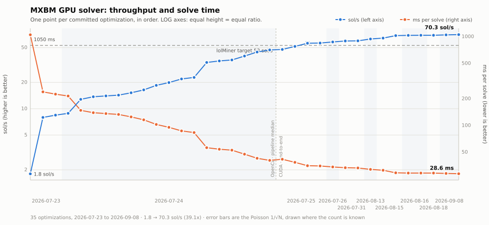
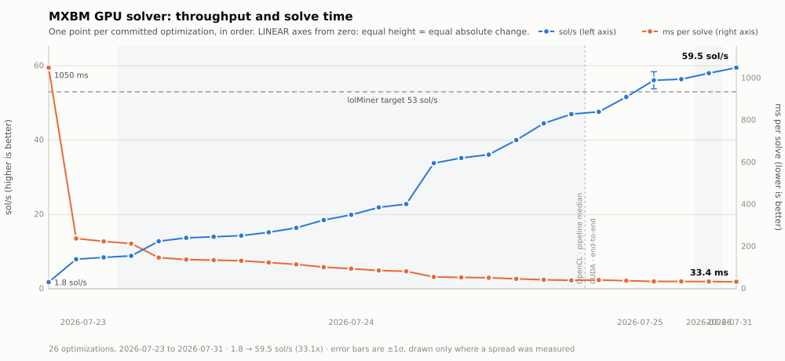
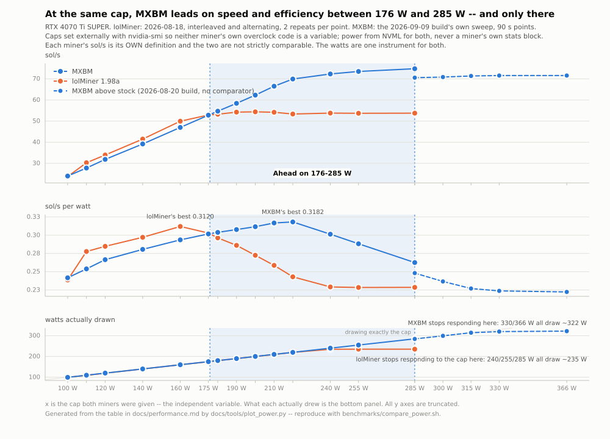
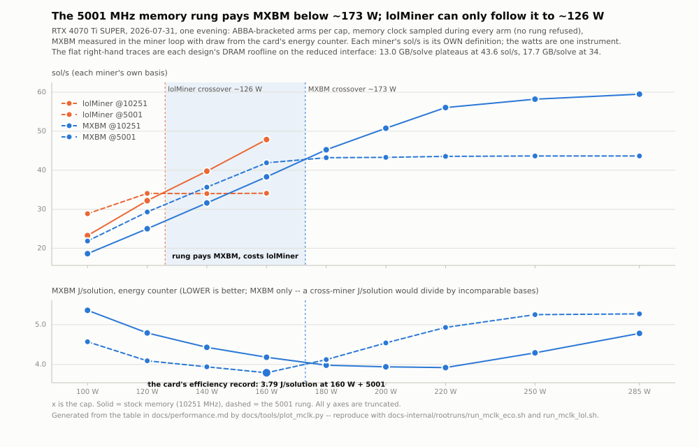
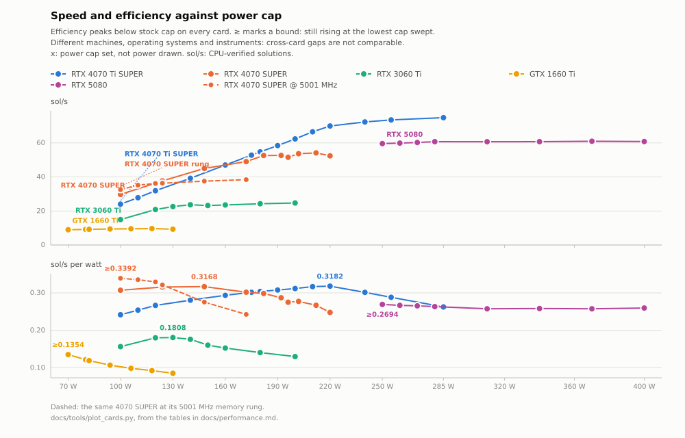

# GPU Performance

The permanent record of MXBM's GPU solver speed and efficiency: the headline figures,
the progress log, the power and efficiency curves, and the measurement caveats that
qualify them. Every number here was produced by a committed benchmark or test in this
repository — nothing is estimated or extrapolated unless explicitly labelled.

**Everything else lives in [performance-research.md](performance-research.md)**: the
solver architecture, every optimization that worked and every one that did not with
the measured mechanism behind each, the established hardware limits, and the open
leads. This page links into it throughout; that page is the one to read before
proposing a new lever, because most of them have already been tried.

**Target:** lolMiner does **~53 sol/s** on an RTX 4070 Ti SUPER at **stock clocks, no
special configuration** (user-measured). BeamHash III yields ~1.9 solutions per solve,
so 53 sol/s ÷ 1.9 ≈ **28 solve/s ≈ 36 ms/solve**. That is the bar.

## Progress log

Median ms per solve, lower is better. "Worked" and "Didn't work" link into
[performance-research.md](performance-research.md).

Rows above the backend switch are `bench_rounds` **pipeline** medians; rows below are
**end-to-end** `solve()` medians including recovery and CPU verification — the stricter
measurement. The two agreed to within a millisecond on OpenCL where both were measured
(40.3 vs 41.0 ms), so the trend is continuous across the switch.





<details>
<summary>Why two scales, and what the error bars mean</summary>

Both charts are generated from the table below by `python3 docs/tools/plot_progress.py`,
so they cannot drift from it.

**Log** makes equal vertical distance mean equal *ratio*, matching the Δ % column, and is
the only way to see the early changes next to a 30× range. **Linear** starts both axes at
zero, so equal height means equal *absolute* change — which shows that almost all of the
ms was won early while almost all of the sol/s came late.

Both charts carry two y axes, which is normally a lie and here is not: sol/s and ms/solve
are one quantity inverted, so no correlation is being implied between two things. On the
log chart the two lines are near-mirror images; on the linear chart the reciprocal's
convexity makes them genuinely different shapes, which is exactly what the sentence above
is pointing at. Relabelling one axis in the other's units instead is *not* available —
`sol/s × ms` is ~1900 over the OpenCL rows and ~1980 over the CUDA ones, so a single
converted ruler would misstate half the chart by 4 %.

The x axis is optimization step, not calendar time: only three dates exist and 16 rows
fall on one of them, so dates are drawn as bands. The dashed divider is the change of
measurement described above, not just of backend.

**Error bars are Poisson on the observed solution count, `1/√N`, and cannot be got by
repeating the run.** Five repeats of the 2026-07-26 build read 58.3/58.4/58.4/58.4/58.4,
σ = 0.045 — which looks precise and is not. A repeat at the same duration replays the
*same nonce sequence*, so it re-observes the same solutions and measures timing jitter
only. The real uncertainty is in solutions-per-solve, and only a longer run samples it:
the 300 s run saw 1.99 where the 120 s runs saw 2.01, nine times that σ. So `58.0 ± 0.4`
is 8,729 solves × 1.99 = 17,371 solutions → `1/√17371` = 0.76 %; the same model gives the
2026-07-25 row its ±2.3 (600 solutions → 4.1 %). Rows without a measured spread stay bare
points rather than being given a fabricated one.

</details>

| Date | Change | Before | After | **sol/s** | Δ ms | Δ % | Worked | Didn't work |
|---|---|---|---|---|---|---|---|---|
| 2026-07-23 | **First working GPU solver** (first share found) | — | ~1050 | **1.8** | — | — | — | — |
| 2026-07-23 | Sort-based collision finder (P1–P3) | 245.0 | 239.0 | **7.95** | −6.0 | −2.4 % | [Sort path](performance-research.md#sort-based-collision-finder) | — |
| 2026-07-23 | Tiled 4-bit × 6-pass radix sort (P4) | 239.0 | 225.0 | **8.44** | −14.0 | −5.9 % | [Tiled radix](performance-research.md#tiled-radix-sort) | — |
| 2026-07-24 | Fixed-width AoS compaction `[7,7,6,5,1]` | 224.4 | 214.5 | **8.86** | −9.9 | −4.4 % | [Compaction](performance-research.md#fixed-width-compaction) | [SoA planes](performance-research.md#soa-word-planes), [runtime widths](performance-research.md#runtime-loop-bounds) |
| 2026-07-24 | Fused row-bucket pipeline (STEP A–C) | 215.0 | 148.0 | **12.8** | −67.0 | −31.2 % | [Row-bucket](performance-research.md#fused-row-bucket-pipeline) | [Un-fused LDS](performance-research.md#un-fused-lds-path), [lead array](performance-research.md#stride-1-lead-array) |
| 2026-07-24 | L5-thin: drop round-5 leaf payload | 151.9 | 139.1 | **13.7** | −12.8 | −8.4 % | [L5-thin](performance-research.md#l5-thin-emit) | — |
| 2026-07-24 | Per-round work compaction on row-bucket | 139.1 | 136.0 | **14.0** | −3.1 | −2.2 % | [Row-bucket compaction](performance-research.md#per-round-compaction-on-the-row-bucket-path) | — |
| 2026-07-24 | Async enqueue (de-bubble) | 135.0 | 133.0 | **14.3** | −2.0 | −1.5 % | [De-bubble](performance-research.md#async-de-bubble) | [Magazine](performance-research.md#shared-memory-magazine), [gi atomic](performance-research.md#global-gi-atomic) |
| 2026-07-24 | Compact `leftContrib` (fold 8 leaves → 1 u64) | 131.1 | 124.8 | **15.2** | −6.3 | −4.8 % | [leftContrib](performance-research.md#compact-leftcontrib) | [General mix-state](performance-research.md#general-compact-mix-state) |
| 2026-07-24 | Packed element record (1 block, not 4 arrays) | 124.8 | 115.7 | **16.4** | −9.1 | −7.3 % | [Packed record](performance-research.md#packed-element-record) | [SoA LDS staging](performance-research.md#soa-lds-staging) |
| 2026-07-24 | Re-derive round-1 seeds from indices | 114.8 | 102.7 | **18.5** | −12.1 | −10.5 % | [Seed re-derivation](performance-research.md#seed-re-derivation) | [Round-2 re-derivation (first attempt)](performance-research.md#round-2-re-derivation-first-attempt) |
| 2026-07-24 | Defer round-1's seed expand to a non-divergent loop | 103.6 | 95.3 | **19.9** | −8.3 | −8.0 % | [Non-divergent expand](performance-research.md#the-non-divergent-expand) | [Deferring the stage read](performance-research.md#deferring-the-stage-read) |
| 2026-07-24 | Round 2 re-derives from a 16 B pair record | 95.3 | 86.8 | **21.9** | −8.5 | −8.9 % | [Re-derivation chain](performance-research.md#the-re-derivation-chain) | — |
| 2026-07-24 | Round 3 re-derives from a 24 B quad record *(later reverted)* | 86.8 | 83.2 | **22.8** | −3.6 | −4.1 % | [Re-derivation chain](performance-research.md#the-re-derivation-chain) | [Register cap](performance-research.md#register-cap-tuning) |
| 2026-07-24 | Bake per-round constants into the fused kernels | 83.2 | 56.2 | **33.8** | −27.0 | −32.5 % | [Compile-time constants](performance-research.md#compile-time-round-constants) | [`gi` elimination](performance-research.md#eliminating-the-dense-gi) |
| 2026-07-24 | **Retire** the round-3 quad record + per-set stride sizing | 56.2 | 54.0 | **35.2** | −2.2 | −3.9 % | [Quad record retired](performance-research.md#retiring-the-round-3-quad-record) | — |
| 2026-07-24 | Drop the redundant `lead` from the round-3 record | 54.0 | 52.7 | **36.1** | −1.3 | −2.4 % | [Redundant lead](performance-research.md#the-redundant-lead-field) | — |
| 2026-07-24 | Round 5 stores **1** work word, not 5 | 52.7 | 47.5 | **40.0** | −5.2 | −9.9 % | [Terminal work words](performance-research.md#the-terminal-rounds-dead-work-words) | — |
| 2026-07-24 | Retune row-bucket geometry to (15, 2) | 47.5 | 42.7 | **44.5** | −4.8 | −10.1 % | [Geometry](performance-research.md#row-bucket-geometry) | — |
| 2026-07-24 | √-scaled bucket capacity → geometry (16, 1) | 42.7 | 40.4 | **47.0** | −2.3 | −5.4 % | [Capacity](performance-research.md#bucket-capacity), [Geometry](performance-research.md#row-bucket-geometry) | [Occupancy, again](performance-research.md#occupancy-again) |
| | | | | | | | | [Occupancy tuning](performance-research.md#occupancy-tuning), [dense key array](performance-research.md#dense-key-array), [decoupled scatter](performance-research.md#decoupled-scatter), [two-level bucketing](performance-research.md#two-level-bucketing) |
| | ↓ *backend switches to CUDA; rows below are **end-to-end**, incl. recover + CPU verify* | | | | | | | |
| 2026-07-25 | CUDA port, algorithm unchanged | 41.0 | 41.6 | **47.6** | +0.6 | +1.5 % | [CUDA backend](performance-research.md#the-cuda-backend) | — |
| 2026-07-25 | 128-bit access on the round-2/3 records | 41.6 | 38.4 | **51.6** | −3.2 | −7.7 % | [CUDA backend](performance-research.md#the-cuda-backend) | — |
| 2026-07-25 | 128-bit access on the remaining records | 38.4 | 35.2 | **56.1 ± 2.3** | −3.2 | −8.3 % | [CUDA backend](performance-research.md#the-cuda-backend) | [cp.async, block size, pair record](performance-research.md#levers-tried-after-the-mio-fix--all-null) |
| 2026-07-25 | Un-pad round 2's record — 9th word to its own plane | 35.16 | 35.0 | **56.4** | −0.2 | −0.6 % | [Alignment pad](performance-research.md#the-round-2-alignment-pad) *(the win is −0.36 GiB; the speed is noise-level)* | — |
| 2026-07-26 | Perfect chain table + group spill → `kFCap` 320 | 35.0 | 34.1 | **58.0 ± 0.4** | −0.9 | −2.6 % | [Group cap](performance-research.md#shipped-the-group-cap-no-longer-has-to-cover-the-tail-125-ms), [Occupancy](performance-research.md#occupancy-is-worth-real-time-and-shared-memory-is-the-only-gate) | [streaming stores, warp-aggregated gi, (17,0), sub-pass, co-tenant entry](performance-research.md#bytes-are-nearly-free-per-element-work-is-not) |
| 2026-07-31 | **Speculative entry co-scheduling** — r4's launch hosts the next nonce's entry as interleaved co-blocks | 33.85 | 33.4 | **59.5** | −0.45 | −1.3 % | [Co-blocks](performance-research.md#co-blocks-the-third-overlap-mechanism-works--and-it-is-worth-04-ms-not-14), [ships](performance-research.md#speculative-entry-co-scheduling-ships-in-the-miner-045-ms) | [pipe2 1:1, split host, r2/r3 hosts](performance-research.md#fused_pair-two-solves-rounds-in-one-launch--the-familys-ceiling-is-05-ms), [register-forced occupancy](performance-research.md#occupancy-is-closed-from-both-resources--r2-sits-on-the-whole-register-file) |
| 2026-07-31 | Below-the-floor pair: r2's 16 B record in one `LD.128` + the terminal round joins the perfect table | 33.4 | 33.2 | **59.7 ± 0.8** | −0.2 | −0.7 % | [Below-the-floor levers](performance-research.md#two-below-the-floor-levers-clear-noise-on-cuda-r2s-pair-record-in-one-ld128-and-the-terminal-round-joins-the-perfect-table-022-ms) *(delta pinned by ×9 replay: r2 −0.145, terminal −0.07; the ± is the 60 s-window σ of the live session below)* | — |
| 2026-08-13 | **Implicit-bits record** — the packed r2 record stops storing the key bits its bucket address encodes; the side plane loses its writer and reader | 33.2 | 32.0 | **62.7 ± 0.9** | −1.2 | −3.6 % | [address-redundant bits](performance-research.md#populations-are-pinned-at-225-and-the-occupancy-tail-prices-a-spill-arena) *(± is the 60 s-window σ of the 80-minute live-pool session)* | — |

| | sol/s | ms/solve | |
|---|---|---|---|
| **OpenCL** | 59.4 | 33.5 | fallback / `--solver opencl` — 2026-08-02, [lineage](performance-research.md#speculative-entry-ported-to-opencl-the-entry-pass-hides-inside-round-4-035-ms); 1.012× of same-session CUDA |
| **CUDA** | **62.7**[^drift] | **32.0**[^drift] | **shipping** — default when a CUDA device is present |
| **Target** | 53.0 | 35.8 | lolMiner, stock — user-measured |

The CUDA row: **6 × 120 s** (`benchmarks/headline.sh`, 2026-08-13, commit
`5c93f0f`), 0.0 % spread, stock 285 W, headless, 240 s warmup discarded,
2610 MHz / 10251 MHz / 281.4 W / 67 °C. New standing condition: `sw_power_cap`
intermittent (~20 % of samples) — the draw now reaches the board limit; any other
flag voids a run. Pool validation: **62.32 ± 1.99 sol/s** over 80 minutes.

[^drift]: Absolute figures carry a ~2.5 % cross-session band ([how far they
    reproduce](#-the-absolute-figures-reproduce-to-03--within-a-session-and-5--between-sessions));
    every A/B on this page was interleaved, so deltas are unaffected. The OpenCL row
    is a single opportunistic 120 s run; its 1.012× gap is a same-session pair
    (2026-08-02), not this row against that one.

> **Quote ms/solve, and treat sol/s as derived.** `sol/s = solves/s × solutions/solve`,
> and only the first factor is a property of the solver. The second is a property of
> BeamHash III (~1.98) that a short run estimates badly: across four runs of this same
> build, ms/solve held at 34.9–35.1 while the measured solutions/solve wandered
> 1.99–2.04, moving the headline by more than a full sol/s. Runs under a few thousand
> solves read **high**. Anything quoted here as a speed *change* is an ms/solve
> comparison for that reason.

**Confirmed by live mining**, 2026-07-31: a 20-minute HeroMiners session on the shipping
binary at stock 285 W — a separate measurement from the benchmark, through the stratum
path on real jobs.

| window | samples | median | mean | σ | min | max |
|---|---|---|---|---|---|---|
| 60 s | 20 | **59.35** | 59.57 | **0.82** | 58.6 | 61.7 |
| 15 s | 83 | **59.60** | 59.51 | 1.93 | 54.2 | 63.9 |

Both medians agree with the benchmark figure (59.7) to under 1 %, shares ran **47
accepted / 0 stale / 0 rejected**, and the card held 284 W / 2595–2685 MHz / 66–68 °C.
The ±0.8 on the progress row is the 60 s-window σ; the session-mean uncertainty is the
Poisson one (~71,000 solutions → ±0.2 sol/s).

The CUDA backend is **~6 % past the target** and OpenCL 1.07× short — read
[the caveats](performance-research.md#the-cuda-backend) before treating the target as
beaten. Started at **1.8 sol/s** → **31× faster**. VRAM for a full search: **8.36 →
6.84 GiB** at the fastest geometry (268 → 219 B/element), and **1.90 GiB** at the CUDA
floor, which clears BeamHash III's stated 3 GB minimum and the card class behind it.
OpenCL floors at **4.04 GiB** — a 5 GB card — since it gained the dense-cap rungs and
stopped [sizing its ladder against total VRAM instead of
free](performance-research.md#the-opencl-ladder-was-answering-against-the-wrong-number),
which had been refusing every card under ~8.9 GiB usable.

<details>
<summary>The earlier 2.5-hour session, and why a peak must never be quoted</summary>

An earlier 2.5-hour session on the 2026-07-25 build:

| window | samples | median | mean | σ | min | max |
|---|---|---|---|---|---|---|
| 60 s | 65 | **56.1** | 55.89 | **2.30** | 39.7 | 58.9 |
| 15 s | 304 | **56.1** | 55.94 | 3.27 | 24.9 | 61.5 |

The median was 56.1 on both windows, matching that build's benchmark median exactly, and
the 60 s σ of 2.30 matched its ±2.3.

Individual 15 s windows in it reached **61.5 sol/s**, which is tempting and wrong: for
σ = 3.27 the expected maximum of 304 draws is ≈ 67, so 61.5 is unremarkable rather than
evidence of a higher true rate. Narrowing the window inflates the peak (61.5 at 15 s vs
58.9 at 60 s) while leaving the median untouched — the signature of noise, not
throughput. The three samples below 45 sol/s are consecutive and coincide with two other
benchmarks being run against the same GPU.

That table was tallied by hand. It no longer has to be: `/summary`'s
`Session_Stats.Speed_60s` accumulates `N`, `Mean`, `Stddev`, `Min` and `Max` over the
whole run for both windows and for power, clocks and temperature — see
[usage.md](usage.md#dashboard-and-monitoring-api).

</details>

*sol/s is the number miners and pools report. BeamHash III yields ~1.9 solutions per
solve, so sol/s ≈ 1900 / (ms per solve).*

---

## ⚠ The absolute figures reproduce to 0.3 % within a session and 5 % between sessions

*(Read before trusting any single-number claim here.)*

**Within a session the measurement is tight**: six 120 s runs at stock spread 0.3 %, with
SM clock, memory clock and board power identical to the last digit.

**Across sessions it is not.** The band this page carries is **~2.5 %** — the worst
same-binary cross-session delta observed since 2026-07-26, across nine-plus stock
sessions. One 2026-07-26 event at +5.5 % remains on record, unexplained and never
recurred. Deltas are unaffected: every A/B here was interleaved.

Under a locked clock the rig reproduces **to the digit across days** (0.0 % spread over
six runs, on each of three pins), so use `LGC=2600 LMC=10251 benchmarks/headline.sh` to
regression-test builds and the stock figure to describe what a user gets. The pin stands
at **32.00 ms** since 2026-08-13, taken with the compute GPU headless — a condition of
the number, since a compositor on the card costs a measured 0.20 ms and ~6 W, and one
that follows the HDMI cable per login, so it is verified from the miner's own banner
each session.

*Reopening: any same-binary session median landing more than ~2.5 % from its peers
restores the 5 % band.*

<details>
<summary>The original observation, the controlled re-measurement, and four rejected explanations</summary>

The same binaries that measured **34.15–34.20 ms** early in one session measured
**35.49–35.72 ms** a few hours later, same machine, unchanged.

`benchmarks/headline.sh` was built to answer it: refuses to start if another process
holds VRAM, runs a discarded 240 s warmup, reports the residual temperature slope, and
records NVML telemetry per run including the `clocks_event_reasons` bitmask the original
measurement never captured. Six runs of 120 s, stock 285 W, card at equilibrium:

| | ms/solve | sol/s | SM | mem | W | °C | capped |
|---|---|---|---|---|---|---|---|
| run 1 | 33.80 | 59.1 | 2685 | 10251 | 284.1 | 67 | 99 % |
| run 2 | 33.80 | 59.2 | 2685 | 10251 | 284.2 | 67 | 100 % |
| run 3 | 33.70 | 59.3 | 2685 | 10251 | 284.1 | 67 | 99 % |
| run 4 | 33.70 | 59.4 | 2685 | 10251 | 284.1 | 68 | 100 % |
| run 5 | 33.70 | 59.4 | 2685 | 10251 | 284.1 | 67 | 100 % |
| run 6 | 33.70 | 59.4 | 2685 | 10251 | 284.1 | 67 | 99 % |
| **300 s** | **33.80** | **58.9** | 2685 | 10251 | 284.1 | 67 | 100 % |

So the 4 % gap was not run-to-run noise mistaken for a regime. The four sessions on
record at the time:

| session | ms/solve | vs fastest |
|---|---|---|
| 2026-07-26 early | 34.18 | +1.3 % |
| 2026-07-26 later | 35.60 | +5.5 % |
| 2026-07-28 sweep (285 W point) | ~33.7 | — |
| 2026-07-28 controlled | 33.75 | — |

Four explanations checked and rejected:

| candidate | evidence against |
|---|---|
| thermal throttling | card is *cooler and clocking higher* in the slow regime — 54 °C / 2760 MHz against 63 °C / 2685 MHz |
| within-run drift | the 15 s windows show no trend: first five average 58.5, last five 58.1 |
| memory clock | 10251 MHz in both regimes, and in the controlled run |
| host CPU contention | the **GPU kernel sum itself rose 34.49 → 35.41 ms** while host overhead moved +0.15 ms |

The slowdown is **on the GPU**. Per-round by replay in both regimes: entry 2.72→2.79,
r1 5.33→5.37, r2 10.38→10.58, r3 9.50→9.78, r4 5.49→5.77, terminal 1.07→1.12 — ~2–3 %
slower in step, pointing at a global clock/power state the logged clocks do not capture.
At stock the card is at `sw_power_cap` 99–100 % of the time, so the SM clock is whatever
285 W happens to buy; the surviving hypothesis is that the same 285 W buys a different
point on the V/f curve on different days.

The band was narrowed from 5 % to 2.5 % on 2026-07-31: the strongest cross-day evidence
is [the full power sweep repeated two days apart](#the-sweep-reproduces-across-sessions),
twelve caps all within 2.5 % (mean −1 %).

</details>

### The locked-clock reference is stable to the digit — run it 2026-07-30

Lock the SM and memory clocks (`LGC=2600 LMC=10251 benchmarks/headline.sh`) and the V/f
point is pinned rather than left to the card's discretion. Two runs bracketing 70 minutes
of continuous varied load — the full 100–285 W head-to-head sweep, both miners, ran
between them:

| | ms/solve | sol/s | SM | mem | W | °C | capped |
|---|---|---|---|---|---|---|---|
| **run A** (21:20) | **34.30** | 58.35 | 2610 | 10251 | 261.8 | 67 | **none** |
| **run B** (22:49) | **34.30** | 58.45 | 2610 | 10251 | 262.1 | 67 | **none** |
| Δ | **0.00 %** | +0.17 % | 0 | 0 | +0.11 % | | |

**The pin removes the suspected mechanism by construction.** At a locked 2610 MHz the
card draws 262 W against a 285 W limit with `clocks_event_reasons: none` — 23 W of
headroom unused, no longer buying clock with watts at all. The original anomaly appeared
*within* a session a few hours apart; runs A and B are 106 minutes apart across the
card's whole power range, a far more hostile interval, and ms/solve did not move.

The cross-day repeat this owed was paid on 2026-08-01: 33.50 ms, six runs, 0.0 % spread
— see [the sweep reproduction section](#the-sweep-reproduces-across-sessions).

**Re-pinned at 33.30 on 2026-08-04, with the compute GPU headless — and the move is
attributed: it is the rig, not the build.** Six runs, 0.0 % spread, 2610/10251, no
throttle flags, 271.1 W. The monitor moved to the motherboard iGPU that day, so the
compositor no longer holds a graphics context on the card; rebuilding the 08-01 pin's
own commit (`553cac7`) and running it headless the same day reads **33.30 to the
digit at 270.4 W** — so the compositor was costing **0.20 ms and ~6 W**, and the
intervening commits are time-neutral. The geometry is unchanged across the move —
still `(16,1)`, the miner reporting `reserving 64 MB (headless)`. Full lineage:
[benchmarking.md](benchmarking.md#the-named-reference-lgc-2600).

**Re-pinned at 32.00 on 2026-08-13** (commit `5c93f0f`, the implicit-bits record):
six runs, 0.0 % spread, 2610 / 10251, 281.4 W, 67 °C, headless. The draw now sits
within 4 W of the board limit and `sw_power_cap` is intermittently active — a
consequence of the busier binary, recorded as a standing condition of stock pins
from here on.

### The memory junction temperature is not observable on this card — dead end

GDDR6X raises its refresh rate as it heats, lowering *effective* bandwidth while the
reported memory clock sits at 10251 MHz — exactly the signature above. **NVML cannot see
it on this card**: field 82 (`MEMORY_TEMP`) returns `Not Supported` idle and under load,
as does the whole `T.Limit` family.

So the VRAM-temperature column lolMiner has is **not available on this class of card** and
should stop being carried as work, and the GDDR6X-refresh hypothesis is not disprovable
with the instruments here — the locked-clock reference carries the question instead.

The probe did find one usable thing: field 83
(`NVML_FI_DEV_TOTAL_ENERGY_CONSUMPTION`) *is* supported, a monotonic millijoule counter.
Wired 2026-07-31 — `--benchmark` prints J total, mean W and J/solution from it, `--tune`
prefers it over the sampler, `/summary` exposes it as `Energy_J`, and `benchmarks/lib.sh`
gained `bench_energy_mj`. Existing tables keep their sampled basis until re-measured
whole.

<details>
<summary>The positive control, because "Not Supported" alone proves nothing</summary>

A bare `Not Supported` is indistinguishable from a wrong struct layout, a failed `dlsym`,
or a handle that is not really a device. The same call, in the same array, asked for
fields this card certainly does answer:

| field | | result |
|---|---|---|
| 82 | `MEMORY_TEMP` | **Not Supported** |
| 186 | `POWER_INSTANT` (control) | Success — 8 852 mW idle, 285 779 mW under load |
| 83 | `TOTAL_ENERGY` (control) | Success — monotonic mJ counter |
| 193–196 | the whole `T.Limit` family | **Not Supported** |

The controls resolve to three digits — 285.8 W under load against a 285 W board limit —
so the field is genuinely absent rather than mis-called. `nvidia-smi -q -d TEMPERATURE`
agrees: `Memory Current Temp: N/A`, `Memory Max Operating Temp: N/A`, `GPU Current
T.Limit Temp: N/A`. A GeForce restriction, not a driver or API-surface problem.

</details>

**How to quote a number from this page:** use the controlled figure with its conditions
attached — 33.3 ms / 59.8 sol/s at stock 285 W, 2670 MHz, 69 °C (2026-07-31, with
speculative entry) — and carry the ~2.5 % cross-session band (narrowed 2026-07-31; see
above). Do not re-derive a headline
from a short run: see the note on solutions/solve under the progress table.

---

## Power and efficiency

*(User-facing summary of these results, plus how to reproduce them on your own
card: [benchmarks.md](benchmarks.md).)*

Every figure above measures **speed**. A run against lolMiner on the
same card measured **power** for the first time, and it does not point the same
way:

| | MXBM | lolMiner 1.98a | ratio |
|---|---|---|---|
| speed (15 s median) | 56.20 sol/s | 53.27 sol/s | **1.055×** |
| power (median) | 284.0 W | 238.7 W | **1.190×** |
| efficiency | 0.198 sol/s/W | 0.223 sol/s/W | **0.887×** |
| temperature | 65 °C | 60 °C | |
| core clock | 2700 MHz | 2745 MHz | |

**~5 % faster, ~11 % less efficient** — 45 W more for 3 sol/s more. On a
power-limited rig, which is most rigs, that reads as a loss.

**It is not one. That table compares two different operating points, and at equal
power MXBM wins both.** All four leads listed when this was first recorded have
now been measured; the rest of this section is what they said. Reproduce with
`benchmarks/power_bench.sh`, `benchmarks/stage_power.sh` and
`benchmarks/power_sweep.sh`.

### The card is at its power limit, in every kernel

`clocks_throttle_reasons.sw_power_cap` reads **Active** continuously under MXBM,
while `hw_slowdown` and `sw_thermal_slowdown` never fire and the GPU sits at
62–65 °C — far from its throttle point. The 285 W is a **board limit being hit**,
not heat, and the 5 °C gap to lolMiner is the *consequence* of drawing
45 W more, not an independent symptom.

That is not a property of one hot kernel. `benchmarks/stage_power.sh` replays a
single stage N times inside the solve that produced its input — so its input
bytes, bucket occupancies and output addresses are the real ones — and solves for
that stage's own time and energy from the shift it causes (since 2026-07-31 the
joules come from the card's energy counter, bracketed around the timed loop
inside the binary; the sampled-watts identity remains the fallback):

    t_s = (T_N - T_1) / (N-1)        E_s = (J_N - J_1) / (N-1)        P_s = E_s / t_s

Re-measured 2026-08-14 on the current kernels, 8 reps, 45 s per stage:

| stage | ms | % of solve | power | J/solve | % of energy |
|---|---|---|---|---|---|
| `entry_scatter` | 2.65 | 8.2 | 284.9 W | 0.76 | 8.2 |
| round 1 | 5.08 | 15.8 | 284.9 W | 1.45 | 15.8 |
| round 2 | 9.30 | 28.9 | 283.0 W | 2.63 | 28.7 |
| round 3 | 8.96 | 27.8 | **281.5 W** | 2.52 | 27.5 |
| round 4 | 5.41 | 16.8 | 283.4 W | 1.53 | 16.7 |
| terminal | 0.98 | 3.0 | 285.7 W | 0.28 | 3.1 |
| **sum** | **32.39** | **100.7 %** | 283.2 W | **9.17** | |

Solve is 32.18 ms in the harness, so the stages account for 100.7 % of it, and
their summed energy lands within 0.4 % of the counter's own whole-solve figure
(9.13 J) — both closures bound anything unattributed (memsets, launch gaps,
readback, CPU verify) at essentially zero. 9.13 J per solve ÷ 1.95 verified
solutions = **4.68 J per solution** at stock.

The implicit-bits record is where the 1.5 ms since the 2026-07-31 profile went,
and it went exactly where its mechanism says: round 2 −0.94 ms and round 3
−0.52, the round that writes the narrowed record and the round that reads it.
No other stage moved by more than 0.06 ms.

Every stage draws the cap. There is no power-hog kernel to fix: the workload
saturates the board limit from `entry_scatter` through the terminal round, and
the driver pulls the core clock down (2595–2745 MHz) to hold 285 W. Only round 3
sits measurably below it — and it runs the highest clock of any stage — because
round 3 is the DRAM-bound round: moving bytes costs this board less than working
the SM does, so the freed power comes back as core clock.

Two consequences, and they matter more than the table:

1. **Energy per solve tracks time per solve.** At a fixed cap, sol/s/W is just
   sol/s ÷ 285. Every speed optimization on record is an efficiency
   optimization of the same size, and no amount of watt-shaving *inside* the
   workload is available independently of it — there is no slack kernel to
   quieten. Matching lolMiner's 0.223 sol/s/W while still drawing
   285 W would need **63.5 sol/s**, against 62.4 measured — 1.8 % away, and only
   reachable through ms/solve. Moving the cap itself is the other lever, and
   it turns out to be the cheap one.
2. **The published comparison is between two different operating points.** The
   lolMiner draws 238.7 W with σ 4.05: it is *not* at the cap, and leaves
   46 W unused. Comparing sol/s/W at stock rewards whichever miner fails to fill
   the machine — see [the equal-power comparison](#the-equal-power-comparison),
   which is the one that decides a power-limited rig.

### The equal-power comparison

`benchmarks/power_sweep.sh`, 90 s per point, board limit set with
`nvidia-smi -pl`, restored afterwards.

**On the sol/s column:** each point is a 90 s run, ~2 000–2 500 solves, and at that
sample size the solutions-per-solve factor reads 2.01 against the 1.99 an 8 500-solve
run measures. Every row is therefore about **1 % high in absolute terms** — the 285 W
row says 57.5 where a long run of the same build says 56.4. The ms/solve column and the
*shape* of the curve are unaffected, since every point was measured identically, and the
shape is what the section is about. They are left as measured rather than rescaled:

*Measured on the build of 2026-07-25, i.e. before the group-cap change took stock from
35.1 to 34.1 ms. Every row would shift down by roughly that much; the knee, which is what
this table is for, is a property of the power curve and does not move.*

| board limit | sol/s | ms/solve | measured | SM clock | sol/s/W | J/solution | Δ speed | Δ efficiency |
|---|---|---|---|---|---|---|---|---|
| 180 W | 45.2 | 44.6 | 180.2 W | 1905 MHz | 0.2508 | 3.99 | −15.1 % | +12.4 % |
| 200 W | 50.6 | 39.6 | 199.8 W | 2220 MHz | **0.2533** | **3.95** | −5.0 % | **+13.5 %** |
| 220 W | 53.8 | 37.2 | 219.6 W | 2460 MHz | 0.2450 | 4.08 | **+1.0 %** | **+9.8 %** |
| 240 W | 55.2 | 36.3 | 239.5 W | 2550 MHz | 0.2305 | 4.34 | +3.6 % | +3.3 % |
| 255 W | 56.3 | 35.6 | 254.4 W | 2625 MHz | 0.2213 | 4.52 | +5.7 % | −0.8 % |
| 270 W | 57.1 | 35.1 | 269.2 W | 2670 MHz | 0.2121 | 4.71 | +7.2 % | −5.0 % |
| 285 W *(stock)* | **57.5** | **34.8** | 284.1 W | 2700 MHz | 0.2024 | 4.94 | +7.9 % | −9.3 % |



> **⚠ The Δ columns are superseded.** They compare capped MXBM against **uncapped**
> lolMiner, assuming lolMiner had no choice about its operating point. It does — `--pl` is
> in its help — and once both are swept the comparison changes shape. The MXBM rows stand
> as MXBM's own curve; for the head-to-head read
> [Both miners under the same cap](#both-miners-under-the-same-cap).

**Efficiency has an interior optimum at ~200 W**, and that it *falls again* at 180 W is
the informative part: below ~200 W the core clock has dropped far enough (2220 →
1905 MHz) that the parts of the board which do not scale with it — memory, uncore,
leakage — are paid for out of less work. At the driver's 100 W minimum the collapse is
unmistakable: 16.3 sol/s, 0.163 sol/s/W.

**Marginal return collapses well before stock.** Extra sol/s per extra watt:

| step | 180→200 | 200→220 | 220→240 | 240→255 | 255→270 | 270→285 |
|---|---|---|---|---|---|---|
| sol/s per W | 0.276 | 0.162 | 0.070 | 0.074 | 0.054 | 0.027 |

The last 45 W (240 → 285) buys 2.3 sol/s; the first 20 W above 180 buys 5.4. The right
cap is an economic choice: **220 W for a rig that pays for electricity, 285 W only where
power is free.**

Reproducibility: the 240 W point appears in both sweeps, same build, an hour apart —
55.5 sol/s / 0.2318 and 55.2 / 0.2305, ~0.6 % spread. The table quotes the second run.

### Both miners under the same cap

*(Measured 2026-07-28 with `benchmarks/compare_power.sh`.)*

The sweep above compares MXBM's whole curve against lolMiner at one **uncapped** point,
on the reasoning that uncapped is how people run it. That reasoning was wrong. lolMiner
1.98a has `--pl` too — it is in the installed binary's help — so it has a curve of its
own, and nobody had measured it. This section is that measurement, and it revises the
conclusion above rather than supporting it.

Both miners, same session, interleaved, alternating which goes first, caps set externally
with `nvidia-smi -pl` so neither miner's own OC code is a variable. Power is sampled from
NVML for both — never taken from either miner's own statistics block, which averages in
its ramp and reads ~20 W low. Two repeats per cell; the spread within a cell is ±0.1 sol/s.

**Re-measured 2026-07-30** on a second session, and extended down to the card's 100 W
floor. The table below is that second session; the reproducibility check against the
first is the subsection that follows.

*(MXBM columns re-measured 2026-08-13 on commit `5c93f0f` — `benchmarks/power_sweep.sh`,
60 s points, single-miner session, stock memory clock, headless. The lolMiner columns
are the 2026-07-30 measurement; its binary is unchanged. The two sessions carry the
documented ±2.5 % cross-session band between them — the 210 W cells are a tie at that
band, not a decided cross.)*

| cap | MXBM sol/s | MXBM W | MXBM sol/s/W | lolMiner sol/s | lolMiner W | lolMiner sol/s/W |
|---|---|---|---|---|---|---|
| 100 W | 19.3 | 99.4 | 0.1942 | **23.05** | 99.3 | **0.2320** |
| 110 W | 21.7 | 109.5 | 0.1982 | **27.75** | 109.2 | **0.2541** |
| 120 W | 25.3 | 119.8 | 0.2113 | **33.40** | 119.5 | **0.2794** |
| 140 W | 31.6 | 139.6 | 0.2263 | **40.45** | 139.6 | **0.2898** |
| 160 W | 37.8 | 159.6 | 0.2368 | **47.60** | 160.1 | **0.2973** |
| 175 W | 42.5 | 174.8 | 0.2431 | **52.25** | 174.7 | **0.2991** |
| 180 W | 44.1 | 179.7 | 0.2454 | **52.35** | 179.6 | **0.2914** |
| 190 W | 47.5 | 189.7 | 0.2504 | **53.05** | 189.8 | **0.2796** |
| 200 W | 50.4 | 199.7 | 0.2523 | **54.00** | 199.6 | **0.2706** |
| 210 W | 53.8 | 209.6 | 0.2567 | 53.90 | 209.6 | 0.2572 |
| 220 W | **56.9** | 219.6 | **0.2592** | 54.35 | 219.4 | 0.2477 |
| 240 W | **60.2** | 239.6 | **0.2512** | 53.75 | 236.6 | 0.2272 |
| 255 W | **61.1** | 254.4 | **0.2402** | 53.90 | 237.5 | 0.2269 |
| 285 W | **62.8** | 284.2 | 0.2210 | 53.65 | 237.4 | **0.2259** |


**The result is three-part.** Crossings are interpolated from the table:

- **Below ~210 W, lolMiner wins on both, and the margin grows as the cap tightens —
  until the very bottom, where it does not.** At 180 W it does 52.35 sol/s to MXBM's
  44.1 (**+18.7 %**); at 160 W, 47.60 to 37.8 (**+25.9 %**); at 120 W, 33.40 to 25.3
  (**+32.0 %**). Then at 100 W the gap *narrows* to **+19.4 %** — see the floor below.
- **Between ~210 W and ~277 W, MXBM wins on both** — by 4.7 % speed and 4.6 % efficiency
  at 220 W, widening to 12.0 % and 10.6 % at 240 W. (Band computed on a fine grid by
  `docs/tools/plot_power.py`, which reads this same table: 210.5–276.9 W.)
- **Above ~277 W, MXBM is faster and lolMiner is more efficient**, which is what the
  stock-versus-stock comparison always showed.

Three facts that reframe the whole comparison:

**lolMiner barely responds to the cap at all.** From 285 W down to 180 W it moves 53.65 →
52.35 sol/s — it gives up **2.4 %** of its speed for **24 %** less power. MXBM over the
same range gives up 30 %. And above ~237 W the cap stops doing anything: the 240, 255 and
285 W rows all draw 236.6–237.5 W, which is why it never reaches the board limit.

**Both miners have an interior efficiency optimum; lolMiner's is higher and further
left.** MXBM peaks at **0.2592 sol/s/W at 220 W**, lolMiner at **0.2991 at 175 W** — a
**15.4 %** gap between one miner at its best and the other at its best. Read both peaks
as *regions*, not points: MXBM's 210 and 220 W rows are 1.0 % apart and lolMiner's 160
and 175 W rows 0.6 %, which is close to this measurement's own repeatability.

**Nothing is hiding below the sweep's old left edge.** lolMiner's efficiency was still
climbing at 180 W when the first sweep stopped, so its peak might have been unmeasured.
Extending to the card's 100 W floor settles it: **both curves fall away monotonically
below their peak**, and lolMiner falls *faster* — its advantage peaks at +32.0 % around
120 W and shrinks to +19.4 % at 100 W.

The sharpest form of it: **lolMiner at 175 W delivers 52.25 sol/s for 174.7 W, where MXBM
needs 209.6 W to deliver 53.8.** Nearly the same throughput for 35 W less.

What MXBM keeps is the top end: **62.8 sol/s against a ceiling of ~54.0**, a **16.3 %**
higher maximum throughput that lolMiner cannot reach at any setting.

*(These comparisons are stock memory on both sides. Each miner's best configuration —
MXBM on the 5001 rung with the low-power kernels — is [the low-band table
below](#the-low-band-after-the-2026-08-1314-kernel-ships).)*

### The sweep reproduces across sessions

The whole sweep was re-run on 2026-07-30, two days after the first, on the same binaries.

<details>
<summary>Point-by-point, both miners</summary>

| cap | MXBM 07-28 → 07-30 | Δ | lolMiner 07-28 → 07-30 | Δ |
|---|---|---|---|---|
| 120 W | 26.30 → 25.65 | −2.5 % | 33.50 → 33.40 | −0.3 % |
| 140 W | 32.65 → 32.45 | −0.6 % | 40.60 → 40.45 | −0.4 % |
| 160 W | 39.35 → 38.80 | −1.4 % | 48.60 → 47.60 | −2.1 % |
| 175 W | 43.95 → 43.75 | −0.5 % | 52.00 → 52.25 | +0.5 % |
| 180 W | 46.05 → 45.15 | −2.0 % | 52.65 → 52.35 | −0.6 % |
| 190 W | 48.75 → 48.15 | −1.2 % | 53.25 → 53.05 | −0.4 % |
| 200 W | 52.15 → 51.25 | −1.7 % | 54.25 → 54.00 | −0.5 % |
| 210 W | 54.15 → 53.95 | −0.4 % | 54.35 → 53.90 | −0.8 % |
| 220 W | 55.40 → 54.85 | −1.0 % | 54.35 → 54.35 | 0.0 % |
| 240 W | 57.20 → 56.95 | −0.4 % | 53.30 → 53.75 | +0.8 % |
| 255 W | 58.00 → 57.85 | −0.3 % | 53.45 → 53.90 | +0.8 % |
| 285 W | 59.15 → 59.05 | −0.2 % | 53.60 → 53.65 | +0.1 % |

**MXBM's deltas are all the same sign** — twelve of twelve slightly slower on the second
day, mean −1.0 % — which is a session offset, not noise; noise would change sign.
**lolMiner's are mixed** (+0.8 % to −2.1 %, mean ≈ −0.2 %), i.e. noise-like. The second
session was marginally unfavourable to MXBM, and every conclusion above is drawn from it,
which makes them conservative.

</details>

Every point of both miners reproduces within 2.5 %, all but three within ~1 %, and the
board power drawn at each cap is identical to a tenth of a watt. This pair is the evidence
that narrowed the headline band from ~5 % to ~2.5 %.

**No conclusion changed.** Both crossings moved by less than one grid spacing (~212 →
~210 W, ~257 → ~256 W), both efficiency peaks moved one row within a flat region, and
lolMiner's saturation ceiling reproduced at 236.6–237.5 W against 235.7–235.8 W.

**The LGC-2600 cross-day repeat, 2026-08-01.** The locked-clock reference ran on a
different day for the first time: six 120 s runs, ms/solve spread **0.0 %** (33.50 to the
digit, all six), SM/mem pinned at 2610/10251, 68 °C, power spread 0.6 %. It moved from
34.30 to **33.50 (−2.3 %)**, and the lineage accounts for it exactly: two kernel changes
shipped 2026-07-31 totalling 0.80 ms, and the draw rose 262 → 277 W at identical clocks —
the signature of a busier binary, not a different rig-day. **Under the pin the rig
reproduces to the digit across days; the number moves only when something about the
machine does** — the build, or the card's other tenants. The 2026-08-04 re-take is
the second kind: −0.6 % on the day the monitor left the compute GPU, attributed by
rebuilding the 08-01 commit and re-running it headless (33.30 to the digit — the
compositor was the whole 0.20 ms and ~6 W). The pin stands at **32.00** (2026-08-13) and carries
"headless" as a stated condition; repeat it after any kernel-shipping day or any
change to what else the card is doing.

### Why we lose the low end: watts buy us less clock

The mechanism is visible in the clocks — **down to 160 W, below which it inverts.**
Mean SM clock per cap, both repeats, 2026-07-30:

| cap | MXBM SM clock | lolMiner SM clock | gap |
|---|---|---|---|
| 100 W | 795 MHz | 435 MHz | **+360** |
| 110 W | 922 MHz | 548 MHz | **+374** |
| 120 W | 1035 MHz | 678 MHz | **+357** |
| 140 W | 1320 MHz | 956 MHz | **+364** |
| 160 W | 1560 MHz | 1556 MHz | +4 |
| 175 W | 1792 MHz | 2392 MHz | **−600** |
| 180 W | 1882 MHz | 2468 MHz | −586 |
| 190 W | 2025 MHz | 2535 MHz | −510 |
| 200 W | 2205 MHz | 2595 MHz | −390 |
| 210 W | 2378 MHz | 2640 MHz | −262 |
| 220 W | 2452 MHz | 2685 MHz | −233 |
| 240 W | 2535 MHz | 2745 MHz | −210 |
| 255 W | 2588 MHz | 2745 MHz | −157 |
| 285 W | 2670 MHz | 2745 MHz | −75 |

**Above 160 W this is the story the section was written to tell.** MXBM's kernels cost
more power per clock, so a tightening cap takes clock away from us faster than from them
— 75 MHz behind at stock, 600 MHz behind at 175 W. The suspect was
DRAM traffic: MXBM moves [14.23 GB/solve](performance-research.md#current-focus-and-open-leads) at geometry
(16,1), while lolMiner selects a **4G** variant that fits the search in 4 GB and must
therefore move far less.

**That suspicion has since been measured, and it accounts for the shape of this table.**
Narrowing round 2's record so the solve moves 16 % fewer bytes buys **60 MHz at 285 W and
210 MHz at 180 W** — the price of a byte rises 5× as the cap tightens, which is exactly
the asymmetry the gap column shows. One lever worth 210 MHz against a 570 MHz deficit
means the whole gap is the right order of magnitude for a traffic story: it needs about
2.7× our lever, and lolMiner's 4 GB variant against our 6.84 GiB is plausibly that. See
[bytes are not free in watts](performance-research.md#but-bytes-are-not-free-in-watts-and-under-a-cap-watts-are-clock-60-mhz).

**This inverts one of our own conclusions.** [Bytes are nearly
free](performance-research.md#bytes-are-nearly-free-per-element-work-is-not) measured that narrowing records buys
almost no *speed*, because the pipeline is latency- and occupancy-bound rather than
bandwidth-bound, and that is why memory efficiency was filed under reach. Under a power
cap bytes are not free at all: they are watts, watts are clock, and clock is speed. What
that promotes is **narrowing records**, which cuts bytes moved; in-place layer reuse cuts
the footprint while moving the same bytes, so it stays a reach lever.

#### ⚠ Below 160 W the clock gap INVERTS, and the clock explanation stops applying

Everything above is a story about clock: lolMiner clocks higher under a cap, and that is
why it wins. **Below 160 W that is not what happens.** At 140 W and under, **MXBM holds a
~360 MHz HIGHER SM clock than lolMiner and still loses by 20–30 % on sol/s.** The sign
flips cleanly at 160 W, where the two are within 4 MHz, and the inversion is present in
both repeats at every point below it.

| cap | clock gap | sol/s gap |
|---|---|---|
| 100 W | MXBM **+360 MHz** | lolMiner **+20.7 %** |
| 120 W | MXBM **+357 MHz** | lolMiner **+30.2 %** |
| 140 W | MXBM **+364 MHz** | lolMiner **+24.7 %** |
| 160 W | +4 MHz | lolMiner +22.7 % |
| 180 W | MXBM −586 MHz | lolMiner +15.9 % |

So in the bottom third of the range the deficit is **not a clock deficit** — it is work
done per clock. The "bytes → watts → clock" chain cannot explain it: that predicts the
miner moving fewer bytes clocks *higher* under a cap, and below 160 W lolMiner clocks
lower.

**Mechanism, settled 2026-07-31.** lolMiner is not duty-cycling — 10 Hz clock sampling
gives a broad but **unimodal** distribution, so it genuinely executes at a median 480 MHz
at 100 W and still outsolves MXBM at 750 MHz by ~22 %. The deficit is **~2.3× useful work
per core cycle**. Below ~190 W everything is issue-bound (103.7 ms at 100 W is 2.94× stock
at 3.38× less clock — even the DRAM-bound rounds stop saturating DRAM, because the LSU
rate scales with core clock), so the currency is instructions issued. Profiling lolMiner
under `ncu` named the reason: a state-storing streaming design, 64 B/element,
17.7 GB/solve, **no derive or rebuild arithmetic anywhere**, so at low caps it has almost
no instructions to issue. See [lolMiner under
ncu](performance-research.md#lolminer-measured-under-ncu-the-state-storing-design-confirmed--and-its-54-sols-ceiling-is-a-dram-roofline).

Our own knobs recover little. Geometry (17,0) deletes the rescan, crosses over at ~190 W
and buys 1 % in the 140–180 W band and 2.6 % at the floor — but it failed same-day
reproduction and auto-selection was built, verified and
[disarmed](performance-research.md#the-eco-sweep-170-crosses-over-below-190-w-r2_full-never-does).
The byte-heavy `MXBM_R2_FULL` **loses at every cap**: re-derivation is the right trade at
all power levels. Tables: [the eco
sweep](performance-research.md#the-eco-sweep-170-crosses-over-below-190-w-r2_full-never-does).

An intermediate reading — that MXBM's own bookkeeping (sub-mask rescans, chain walks) was
the cost — was tested and is **wrong**: [the reorganization
probes](performance-research.md#the-solver-reorganization-probes-the-cycle-deficit-is-not-bookkeeping)
measured bookkeeping at ~0.6 ms of round 1's 4.9.

#### ⚠ Closed 2026-07-29: the low end is not reachable by traffic, and no other mechanism has been found

**Traffic cannot close the low end.** Closing the 570 MHz clock deficit at the measured
exchange rate needs **≥ 6.2 GB of a 13.0 GB solve — 48 % of all traffic**. Every
narrowing the [record audit](performance-research.md#the-record-redundancy-audit) leaves
available totals 1.07 GB: **≤ 98 MHz, 17 % of the deficit.**

Two other candidates died in the same week:

- **Instruction issue.** Moving siphash's four 64-bit adds off the saturated ALU pipe is
  arithmetically impossible on this ISA: sm_89 has no `IMAD` form that writes a carry-out,
  so `ptxas` lowers `mad.lo.cc.u32` to `IMAD.IADD` **plus** a carry-synthesising `LEA`,
  and the ALU pipe gets *busier* (`entry_scatter` 855 → 876). The surviving rotate-only
  form is ≈0.18 ms, under the 1 %-of-a-solve floor.
- **Undervolting.** Untestable at the time, because the benchmark card drove the display.
  It became testable when the monitor moved to the motherboard iGPU and was then
  [measured and closed](performance-research.md#undervolting-buys-nothing-under-a-power-cap--the-cap-outranks-both-knobs):
  null under every cap, because the power governor outranks the clock lock.

**The practical conclusion, and what has since moved.** MXBM's advantage is a band:
lolMiner below the crossing, MXBM between the crossings, and MXBM alone above the upper
one at a ceiling lolMiner cannot reach at any setting. That shape still holds; the figures
in it do not. On the current kernels the band is **~210 W to ~277 W** and the ceiling
**62.8 sol/s against ~54.0** — see
[both miners under the same cap](#both-miners-under-the-same-cap), which is the live
table. The low-end verdict has moved furthest: "not supportable below 210 W" was true of
the 07-29 build, and the gap there is now **−6 to −12 %** once both miners run their best
low-power configuration.

*Reopening: a no-replay 180 W A/B putting the whole-solve rate materially above
92 MHz/GB; a narrowing worth more than 1.07 GB; or a machine where the compute GPU does
not drive the display. The first two would move the arithmetic, not the conclusion —
48 % of all traffic is a long way from 1.07 GB.*

<details>
<summary>The withdrawn arithmetic, and how the closure survived three later challenges</summary>

The original "2.7× our lever" estimate divided a whole-solve clock deficit by a lever
measured on a `MXBM_ROUND_REPS=2:24` replay timeline, priced against a denominator nobody
had measured. Both terms were wrong, both optimistically.

**The denominator.** `benchmarks/abl_bytes.sh` shows ablating round 2's payload removes
**1.47 GB**, not the 2.09 GB the derivation gave — that figure scaled round 2's
*compulsory* write and charged the ablation with 268 MB of back-refs it never touches. Two
mechanism questions closed with it: a 16 B store costs a full **32 B sector** (805 MB
predicted at 16 B, 1342 at 32 B, 1330 measured), and there is **no read-for-ownership**
(that would have added ~1074 MB of read; read moved +7.8 MB).

**The numerator is still a replay clock**, measured on a timeline that is ~91 % round 2
while round 2 is 30 % of a real solve. At 285 W the narrowed ×24 replay clocks 2670
against a real-solve baseline of 2685, so the whole-solve gain there is ≤ 0, not +60.

| | replay timeline | whole solve |
|---|---|---|
| exchange rate | 210 / 1.47 = **143 MHz/GB** | **≤ 92 MHz/GB** |

Three later results tested the closure and it held each time. Instruction issue as the
low-cap currency is real but small — geometry (17,0) buys up to 2.6 % against a 20–30 %
deficit. A full reorganization of the match (counting-sort runs, keys-only 8 B staging,
register pairing; chains, rescans, spill and most barriers deleted) produced the exact
pair multiset of the shipping round-1 kernel and ran **1.75× slower**, and its ablation
carve put all bookkeeping at ~0.6 ms of round 1's 4.9 — 12 % of the round, not the 55 %
that reading needed. Finally `ncu` on lolMiner's own binary named the mechanism from the
other side: a state-storing streaming pipeline, 64 B/element, 17.7 GB/solve against our
13.0, no re-derivation anywhere, sustaining ~494 GB/s — which makes its ~54 sol/s ceiling
a DRAM roofline and the 2.3× simply the absence of our arithmetic. The band structure of
this whole comparison is one design trade held from opposite ends. See [lolMiner under
ncu](performance-research.md#lolminer-measured-under-ncu-the-state-storing-design-confirmed--and-its-54-sols-ceiling-is-a-dram-roofline).

</details>

### Above stock: the curve continues to ~311 W, and the memory rung is unreachable

*(Measured 2026-07-29, current build, 60 s arms, bracketed. Every power sweep in this
document stops at the 285 W stock limit; the board's own maximum is 366 W, so the top of
the curve had never been measured.)*

| cap | ms/solve | sol/s | SM clock | **drawn** | sol/s/W | vs stock |
|---|---|---|---|---|---|---|
| 285 W *(stock)* | 33.8 | 58.7 | 2685 MHz | 284.0 W | 0.2067 | — |
| 300 W | 33.5 | 59.2 | 2715 | 299.1 | 0.1979 | −4.2 % |
| **315 W** | **33.3** | **59.6** | **2745** | 309.4 | 0.1926 | −6.8 % |
| 330 W | 33.3 | 59.6 | 2745 | **311.2** | 0.1915 | −7.3 % |
| 366 W | 33.2 | 59.7 | 2745 | **311.2** | 0.1918 | −7.2 % |

**MXBM saturates at ~311 W.** The 330 W and 366 W caps draw the same 311.2 W and return
the same clock, so above ~315 W the cap stops binding — the mirror of the behaviour this
document records for [lolMiner at ~236 W](#both-miners-under-the-same-cap). The 285 W
bracket reproduced exactly (33.8 / 58.7 before and after), and thermals are not the limit
at any rung: 68 °C at 366 W against a 64 °C stock baseline.

**`--pl 315` is the operating point above stock**, worth **+1.5 % speed for +8.9 % power**.
The marginal return over 285 → 315 W is **0.035 sol/s per W**, which is *higher* than the
0.027 this document records for the 270 → 285 step — the curve does not roll off above
stock the way extrapolating the sub-stock sweep would suggest. It is still a goal-2 lever
bought at a goal-3 cost, and 220 W remains the recommendation for a rig that pays for
electricity.

**The 10501 MHz memory rung is not reachable, and this is a mechanism rather than a
null.** The card advertises it (`nvidia-smi -q -d SUPPORTED_CLOCKS` lists
10501/10251/5001/810/405) and every figure ever published here was taken at 10251, so it
looked like free bandwidth for a pipeline at 76–80 % of DRAM peak in rounds 3 and 4.
`nvidia-smi -lmc 10501,10501` **applies at idle and is dropped the moment the workload
runs** — six bracketed arms at stock all reported 10251 under load with
`sw_power_cap` active, and the rung is still not taken at a 366 W cap where the cap does
not bind. `benchmarks/mclk_rung.sh` reproduces this; its `MEM_MHz` column exists precisely
so the null cannot be mistaken for a measurement of the rung. What was measured is that
the lever cannot be applied, not that it does not pay.

### Below stock the OTHER rung pays: −8.5 to −14.4 % under caps below ~173 W, and a new efficiency record

The down-rung is the up-rung's mirror, and it is honored: `-lmc 5001,5001` held in
every arm of an 18-arm ABBA-bracketed sweep (2026-07-31, miner loop, energy-counter
draw; full table and mechanism in
[the research doc](performance-research.md#the-5001-memory-rung-85-to-144--below-its-173-w-crossover--the-largest-low-band-lever-ever-measured-here)).
Under a core power cap the memory clock does not scale, so the interface burns a fixed
slice of a small budget for bandwidth nothing is using; at 5001 MHz those watts come
back as core clock. Measured: **−14.3 % at 100 W, −14.4 % at 120, −10.8 % at 140,
−8.5 % at 160; crossover ~173 W; above it the rung is a wall** (46.5 ms flat from
200 W up — the solver's own DRAM roofline at 280 GB/s sustained, 87 % of the rung's
peak, with draw saturating at ~230 W under a 285 W cap).

**The efficiency-optimal operating point moved onto the rung: 160 W + 5001 MHz gives
3.70 J/solution** (2026-08-14, 120 s pairs in mirrored order — the 2026-07-31 sweep read
3.79 there). The gain at this cap is the implicit-bits record shipped 2026-08-13, not the
low-power pair: that gate fires only below 130 W. Guidance for capped rigs: below ~170 W, always
pair the cap with the rung — `sudo mxbm ... --pl <cap> --mclk 5001` (both restored on
exit), or `sudo nvidia-smi -pl <cap> -lmc 5001,5001` once at boot on rigs that mine
unprivileged. At or above ~180 W, never.

**lolMiner was swept at the same rung the same evening** (same ABBA discipline, its
sol/s from its own steady 15 s windows — its definition, not comparable to ours
row-for-row; the watts are one instrument for both). It rides the rung too, but only
to ~126 W: its store-everything design needs ~17.7 GB/solve, so on the rung it
plateaus at **~34 sol/s flat from 120 W up** — its own DRAM roofline at the reduced
interface (263–301 GB/s sustained depending on its per-solve counting; at or near the
rung's ceiling either way), against our plateau of 43.6. Below ~126 W its interface
refund is *larger* than ours (+24 % at 100 W against our +14 %) — it was burning even
more of a tiny budget on bandwidth. Net, with each miner at its best memory clock per
cap, the low-band gap roughly halves in the 120–160 W band (from ~25–29 % to ~11–16 %
on reported figures) and *widens* at the 100 W floor.

| cap | MXBM sol/s @10251 | @5001 | MXBM J/sol @10251 | @5001 | lolMiner sol/s @10251 | @5001 |
|---|---|---|---|---|---|---|
| 100 W | 18.6 | 21.85 | 5.36 | 4.57 | 23.25 | 28.85 |
| 120 W | 25.0 | 29.3 | 4.79 | 4.09 | 32.2 | 34.05 |
| 140 W | 31.6 | 35.65 | 4.43 | 3.94 | 39.75 | 34.0 |
| 160 W | 38.3 | 41.9 | 4.18 | 3.79 | 47.85 | 34.1 |
| 180 W | 45.25 | 43.2 | 3.98 | 4.12 | — | — |
| 200 W | 50.75 | 43.3 | 3.94 | 4.54 | — | — |
| 220 W | 56.05 | 43.55 | 3.92 | 4.93 | — | — |
| 250 W | 58.2 | 43.65 | 4.29 | 5.25 | — | — |
| 285 W | 59.5 | 43.65 | 4.78 | 5.27 | — | — |

*The lolMiner dashes above 160 W are "not measured", and deliberately: its
stock-memory curve at 180–285 W is already in the head-to-head table above, and its
rung column cannot move — it is bandwidth-bound there, proven inside the sweep itself
(140 → 160 W added 20 W of draw and 0.1 sol/s). Re-measuring a plateau three points
already pin would be arms spent on a foregone answer.*



### The low band after the 2026-08-13/14 kernel ships

Three floor levers landed since the sweep above: match-first × (17,0) behind the
~130 W gate, the implicit-bits record at stock, and the same record generalized to
the (17,0) pack ([the mechanism and A/Bs](performance-research.md#measured-results-2026-08-14)).
The miner's own benchmark, headless, 5001 rung, two 120 s runs per point in mirrored
cap order (arms agree within 1.5 % everywhere), against the sweep table's lolMiner
best-per-cap column. **The 130 W gate splits this table**: 100 and 120 W run match-first
× packed (17,0) and carry all three levers; 140 and 160 W run (16,1) packed and carry
only the stock-geometry record, so they are unchanged by the 08-14 ship.

| cap | MXBM ms/solve | sol/s | J/sol | lolMiner best | gap |
|---|---|---|---|---|---|
| 100 W | 78.8 | 25.5 | 3.94 | 28.85 | −11.6 % |
| 120 W | 63.0 | 31.9 | 3.76 | 34.05 | −6.3 % |
| 140 W | 54.3 | 37.0 | 3.79 | 39.75 | −6.9 % |
| 160 W | 46.6 | 43.2 | 3.70 | 47.85 | −9.7 % |

The 120–160 W gap that the rung halved to ~11–16 % is now single-digit across the
band, and the 100 W floor — ~24 % after the rung, ~32 % before it — stands at
~12 %. The efficiency curve is nearly flat from 120 to 160 W (3.70–3.79 J/sol).
Stock is unchanged (31.7 ms same-session against the 32.00 pin's band).

### The memory traffic is compulsory

Per solve, against the minimum the round schedule and record widths require —
each round reading its input layer once and writing its output layer once:

| stage | compulsory rd | wr | measured rd | wr | excess |
|---|---|---|---|---|---|
| entry | — | 268 MB | 5 | 258 MB | −1.9 % |
| r1 | 268 | 805 | 271 | 796 | −0.6 % |
| r2 | 537 | 2685 | 543 | 2811 | +4.1 % |
| r3 | 2416 | 2416 | 2427 | 2398 | −0.2 % |
| r4 | 2147 | 805 | 2149 | 802 | −0.1 % |
| terminal | 537 | — | 539 | 1 | +0.4 % |
| **total** | | | **13.00 GB** | | **+1.0 %** |

Measured traffic is within **1 %** of compulsory: no write amplification, no
redundant re-reads, nothing left for the cache to save. The 13.0 GB is not waste
— it is what a 72 B element costs when five rounds each consume a layer and
produce one. The kernel times sum to **101 %** of the solve, which also rules out
the fourth lead: there is no idle spin between rounds to reclaim.

This is the post-fix profile (`sudo ./cuda/profile.sh`, 2026-07-25). Before
[the pad was removed](performance-research.md#the-round-2-alignment-pad) the total was **13.51 GB**:
round 3's read fell by exactly the predicted 268 MB and round 2's write by
204 MB, the shortfall being the sector granularity of splitting one store stream
into two. Round 2 is now the only line materially above compulsory, and that
+4.1 % is the same split — it writes 72 B of record as 64 + 8 to two places.

So the byte count can only fall by making records narrower, and one place was
found where a record was wider than its own contents ([the round-2 alignment
pad](performance-research.md#the-round-2-alignment-pad)), and one where the record
carried bits its own address already encoded ([the implicit-bits
record](performance-research.md#populations-are-pinned-at-225-and-the-occupancy-tail-prices-a-spill-arena)).
Everything else needs the structural change in
[HW_REQUIREMENTS.md](HW_REQUIREMENTS.md#the-design-target-is-met):
streaming / in-place layer reuse.

### What the footprint still costs

The sweep settles the *ranking*, not the *margin*. At its own operating point the
lolMiner spends **4.48 J per solution**; MXBM spends **4.94** at stock and
only undercuts it by capping — 4.08 at 220 W, 3.95 at the ~200 W peak. Winning by
11 % on energy while giving up 12 % of throughput to get there is a real lead but
a bought one, and where the rest of it went is not mysterious: 13.0 GB of
compulsory traffic per solve. **Traffic, specifically — not the footprint it
sits in.** Those were treated here as one problem and they are two:
[the byte-power measurement](performance-research.md#but-bytes-are-not-free-in-watts-and-under-a-cap-watts-are-clock-60-mhz)
prices the bytes *moved* at 60 MHz of sustained clock per 16 % of traffic, while
a smaller peak allocation that moves the same bytes to reused addresses buys
none of that. Narrowing records extends this lead; in-place reuse extends the
range of cards that can run at all.

Full data, method and caveats for the head-to-head: `docs-internal/MINER_COMP_RESULTS.md`.
The two runs were not simultaneous, so lolMiner's power figure still
wants a back-to-back rerun before it is quoted outside that document.


---

## Apple Silicon (Metal) — M3 Max, 2026-07-30

A second reference platform. Everything else in this document is the 4070 Ti; this
section is the Mac, and the two are not comparable except in shape.

| path | median ms/solve | sol/s | notes |
|---|---|---|---|
| OpenCL, sort | ~505 (494.6 / 516.6) | ~3.8 | the only OpenCL path that runs here |
| OpenCL, LDS | — | — | `clCreateKernel` → `CL_INVALID_KERNEL` |
| OpenCL, row-bucket | — | — | `clCreateKernel` → `CL_INVALID_KERNEL` |
| Metal, fused row-bucket (rebuild) | 117 (117.4 / 116.9) | 16.2 | the CUDA-shipping configuration |
| **Metal, fused row-bucket (SEEDF)** | **101.5** (102.3 / 100.7) | **18.8** | **default on Apple**, see below |

**Apple's OpenCL cannot build the fused kernels at all.** Both the LDS and row-bucket
collision finders fail at `newComputePipelineState`, which is why every macOS-relevant
GPU test in `CMakeLists.txt` is pinned to `MXBM_NO_ROWBUCKET=1`. So on this hardware
OpenCL is confined to the slowest of the three finders, and Metal is not a faster
dialect of the same pipeline — it is the only way to run the fused one.

`bench_rounds`-equivalent figures above come from `MXBM_BENCH=20 test_metal_solver`,
median over 20 solves across two sessions, per this document's own rule that a maximum
of noisy draws reads high.

**The miner's per-solve overhead is ~0; what moves is thermal.** `--benchmark BEAM-III`
on an idle machine:

| run length | median | p5 | p95 | sol/s |
|---|---:|---:|---:|---:|
| 12 s | 119.3 ms | 116.6 | 126.3 | 14.3 |
| 45 s | 130.9 ms | 116.8 | 153.2 | 15.3 |

The **p5 is 116.8 ms in both — the pipeline's own 117 ms**, which agrees with the 1.6 ms
the GPU timing measures outside the kernels. Nonce iteration, stats and the difficulty
filter cost essentially nothing. What rises with run length is the median and the p95,
which is a MacBook throttling under sustained load, not overhead.

So quote 117 ms as the pipeline figure and ~15 sol/s as the sustained one, and expect
the gap between them to widen with ambient temperature and run length rather than being
fixable in software.

> **Benchmark figures here are only valid from an otherwise-idle machine.** A 155.2 ms
> reading, with a ~38 ms gap that looked like work outside the pipeline, turned out to be
> builds and tests competing for the same GPU. It does not reproduce on an idle one.

Threadgroup memory, the resource the fused rounds are bound by (32 768 B ceiling,
measured):

| kernel | Metal | CUDA | of ceiling |
|---|---|---|---|
| `fused_round_r1` | 18 992 B | 18 980 B | 58.0 % |
| `fused_round_r2` | 23 600 B | — | 72.0 % |
| `fused_round_r3` | 26 160 B | 26 148 B | 79.8 % |
| `fused_round_r4` | 22 320 B | — | 68.1 % |
| `terminal_round` | 9 744 B | — | 29.7 % |

The r1/r3 agreement to within 12 B (the `gcount`/`cnt8` atomics rounding) is the
strongest available evidence that the two ports allocate the same shape.

### Where the 117 ms goes

Per-phase GPU time (`MXBM_METAL_TIMING=1`, from `MTLCommandBuffer`'s
GPUStartTime/GPUEndTime, so this is GPU execution and not the wall clock around the
submit):

| phase | rebuild | SEEDF (default) | |
|---|---:|---:|---|
| entry | 12.0 | 12.2 | |
| r1 | 23.4 | 26.2 | pays for the wider record |
| **r2** | **44.0** | **24.3** | **38 % of the solve, before** |
| r3 | 17.1 | 17.1 | |
| r4 | 14.0 | 14.2 | |
| terminal | 4.4 | 4.4 | |
| recover | 0.0 | 0.0 | |
| **GPU** | **115.0** | **98.4** | wall +1.6 ms |

The six per-round command buffers, each with a `waitUntilCompleted`, cost **1.6 ms
total** — batching them is not a lead. r2 is the whole story.

### r2's rebuild does not hide on Apple — 21 ms exposed, against 0.4 ms on Ada

`-DMXBM_METAL_ABL_DERIVE=2` replaces `rebuild_r2`'s 14 `siphash24` calls with a cheap
spread. Results are intentionally wrong; the ablation is safe because the rebuild reads
only threadgroup memory and registers, so the global access footprint is untouched and
the number measures compute alone.

```
baseline   entry 12.1  r1 23.4  r2 43.9  r3 17.1  r4 13.9  terminal 4.4  | GPU 115.0
ABL=2      entry 12.2  r1 23.4  r2 22.9  r3 17.1  r4 13.9  terminal 4.4  | GPU  93.9
```

**21.0 ms of exposed compute.** The same rebuild costs **0.4 ms** on Ada
(performance-research.md, "Register cap tuning") because Ada's memory-level parallelism
absorbs it. This is the single largest architectural divergence found between the two
backends, and it is where any further Apple work should start.

### The fix: round 1 stores what round 2 was rebuilding (SEEDF) — 14 % faster

Round 1 already computes the exact element round 2 reconstructs: r1 emits
`apply_mix(combine(a, b, 424), {li, ri}, 2, 424)`, and `rebuild_r2(pp, li, ri)` recomputes
precisely that from the two seed indices. So r1 stores it instead — its record goes from
2 u64 to 9 — and r2 reads it. **This is the CUDA source's `LM_SEEDF` idea, which loses on
Ada and wins here**, because the compute it removes is exposed on Apple and hidden on Ada.

Cold, uncontested, medians over 6–8 solves with the baseline bracketed either side:

| | r1 | r2 | GPU total | pipeline median |
|---|---:|---:|---:|---:|
| rebuild | 23.4 | **44.0** | 115.0 | 117.8 ms |
| **SEEDF** | 26.2 | **24.3** | **98.4** | **101.5 ms** |

**−16.3 ms, 13.8 %** — 16.2 → 18.8 sol/s. The ranges do not overlap (SEEDF 100.1–104.9,
rebuild 116.8–119.3). r1 pays 2.8 ms for the wider write; r2 saves 19.7 ms, which is the
ablation's 21 ms less the cost of reading the wider record. Every other phase is
unchanged to within noise, which is the internal check that the change did what it says.

The win is larger under thermal load, not smaller (r2 55.8 → 25.4 ms when hot), because
the rebuild's compute is itself part of what generates the heat.

SEEDF is the **default on Apple**. `MXBM_METAL_REBUILD=1` selects the CUDA-shipping
configuration; both kernel pairs live in the same metallib and the host picks at runtime,
so the A/B needs no rebuild.

> **Measure the thing; do not divide two numbers and call it a bandwidth.** This change
> was predicted to net only ~4 ms, and declined on that basis. The arithmetic assumed
> ~251 GB/s effective bandwidth, inferred by dividing round 3's traffic by its wall time —
> but round 3 is not purely bandwidth-bound, so the real figure is far higher and the
> extra traffic much cheaper than predicted.

### Three nulls, so they are not re-proposed

<details>
<summary>Threadgroup size, occupancy via smaller groups, 128-bit vector access</summary>

- **Threadgroup size.** Bracketed medians over 10 solves: 128 → 144.6, 192 → 126.7,
  256 → 117.0/117.3, 288 → 116.6, 320 → 116.8/116.9, 352 → 118.3, 384 → 136.0,
  512 → 144.8. Flat across 256–320; the 0.3 ms between them is inside the spread. An
  earlier single-solve sweep read 320 as a 1.2 % win — it did not replicate.
- **Occupancy via smaller groups.** Cutting `kFCap` to fit two threadgroups per core's
  32 KB, with `sm` raised to keep groups full, makes r2 monotonically *worse*:
  (FCAP, sm) = (320,1) → 118.5, (192,2) → 125.3, (160,2) → 129.1, (128,3) → 178.0.
  The extra groups pay table-init, barriers and sub-mask passes that outweigh anything
  the occupancy buys. Apple is not occupancy-limited here in the way Ada is.
- **128-bit vector loads and stores.** CUDA documents `4 x ST.128 + 1 x ST.64` beating
  `9 x ST.64`, because round 3's top stall there is MIO-queue *instruction* issue.
  Ported to `ulong2` on Metal it measures **neutral to slightly worse** (117.9 vs 117.1
  median), so the scalar form is kept and the complexity is not.

</details>

### A measurement hazard worth knowing

Single-solve timings on this machine are thermally confounded: an identical configuration
read 115 ms early in a sweep and 133 ms late, and one FCAP sweep drifted 16.7 ms end to
end — enough to invent a 14 % "win" out of nothing. Every figure above is a median over
≥ 10 solves with the baseline repeated first *and last*; if the two brackets disagree by
more than a millisecond or two the run is discarded.

The `bb + sm = 17` line is carried over from Ada and not re-tuned here. Register counts
are not observable on Metal (`tests/test_metal_resources.mm`), so Ada's occupancy work has
no direct equivalent.

---

**Reference hardware** for every measurement below: RTX 4070 Ti SUPER (Ada, sm_89,
66 CUs, 16 GB, 48 KB LDS/workgroup, ~510 GB/s achievable copy bandwidth).

**How to reproduce.** Two figures are quoted throughout, and they measure different things:

- `./build/bench_rounds 20` — median over 20 runs of the **solver pipeline** (entry through
  terminal). This is the controlled number used to make optimization decisions.
- `./build/tests/test_gpu_solver` — **end-to-end `GpuSolver::solve()`**, including survivor
  readback, back-reference recovery and CPU verification. Take `solve #2` (steady state,
  persistent buffers); `solve #1` pays one-off allocation. This is what a miner reports,
  so it is the headline.

Both are noisy at the ~1 ms level, so single samples are not meaningful — quote a median
of at least 5. `MXBM_NO_ROWBUCKET=1` forces the fallback sort path.

sol/s ≈ 1900 / ms, since BeamHash III yields ~1.9 solutions per solve.

---

## Third-party hardware — a two-card rig, 2026-08-02

Contributed: `--tune` sweeps plus a 21-minute pool session. MXBM 0.7.253, driver
610.62, Windows, both cards on CUDA. Different silicon and cooling from the
reference card, so only the shape of each curve transfers.

**RTX 4070 SUPER** (Ada, 12 GB, 192-bit), stock memory:

| cap W | draw W | sol/s | ms/solve | sol/s/W |
|---|---|---|---|---|
| 220 | 213.8 | 43.88 | 44.8 | 0.2053 |
| 212 | 205.3 | 44.83 | 43.5 | 0.2183 |
| 202 | 195.8 | 44.28 | 44.4 | 0.2262 |
| 196 | 191.1 | 44.13 | 44.9 | 0.2309 |
| 192 | 187.5 | 42.87 | 45.7 | 0.2287 |
| 182 | 176.9 | 41.77 | 46.9 | 0.2361 |
| 172 | 167.6 | 42.30 | 46.2 | 0.2524 |
| 148 | 144.3 | 36.93 | 53.7 | 0.2559 |
| 124 | 121.1 | 30.25 | 66.4 | 0.2498 |
| 100 | 97.2 | 22.41 | 87.6 | 0.2305 |

**RTX 3060 Ti** (Ampere, 8 GB), stock memory:

| cap W | draw W | sol/s | ms/solve | sol/s/W |
|---|---|---|---|---|
| 200 | 195.2 | 22.41 | 88.1 | 0.1148 |
| 180 | 175.9 | 21.92 | 90.5 | 0.1246 |
| 160 | 155.9 | 21.04 | 94.4 | 0.1350 |
| 150 | 146.5 | 20.79 | 95.9 | 0.1419 |
| 140 | 136.7 | 19.70 | 100.5 | 0.1442 |
| 130 | 126.8 | 19.11 | 104.7 | 0.1506 |
| 120 | 116.9 | 17.14 | 115.8 | 0.1467 |
| 100 | 98.0 | 11.71 | 171.9 | 0.1196 |



Generated from the tables above and the head-to-head table by
`docs/tools/plot_cards.py`. **Not a controlled comparison** — different machines,
operating systems and instruments — so cross-card distances are unreliable. Each
curve's shape and its own efficiency peak are what transfer.

### The memory rung's crossover is a property of the card, not of the algorithm

The 5001 MHz down-rung pays below ~173 W on the 4070 Ti SUPER
([the record](#below-stock-the-other-rung-pays-85-to-144--under-caps-below-173-w-and-a-new-efficiency-record)).
On the 4070 SUPER it pays only below **~121 W**, and above that it is expensive:

| cap W | draw W | sol/s | ms/solve | sol/s/W |
|---|---|---|---|---|
| 172 | 156.9 | 30.20 | 66.5 | 0.1925 |
| 148 | 139.0 | 30.15 | 66.5 | 0.2169 |
| 124 | 116.8 | 29.84 | 67.3 | 0.2555 |
| 120 | 113.4 | 29.60 | 66.6 | 0.2609 |
| 110 | 107.0 | 28.50 | 70.3 | **0.2663** |
| 100 | 97.9 | 25.62 | 78.0 | 0.2616 |

At 148–172 W the rung costs ~29 %. The mechanism is in the column: from 172 W down
to 120 W the time is **pinned at ~66.5 ms regardless of cap**, so the memory system
binds and the power cap does not. A 192-bit bus against the reference card's
256-bit is three quarters of the bandwidth at the same clock, which moves the
crossover 50 W. `--tune` found it unaided and recommended the rung only below
121 W.

The 3060 Ti got no rung pass: its GDDR6 runs at 6801 MHz stock and offers no 5001
rung. Correct, but the sweep skipped it silently and should name the skip.

### Open: the tune harness and the miner loop disagree

`--tune` measured the 4070 SUPER at **43.88 sol/s @ 220 W**; the live miner reported
**48.12 @ 219 W** in the same session, with the pool-side rate favouring the higher
figure. The discrepancy runs in the harder direction — the other card was idle
during the sweep and at 82 °C / 96 % fan during mining. The reported rate also
climbed 41.7 → 48.1 over twenty minutes while the core clock *fell* 2700 →
2550 MHz, which should not happen for a compute-bound kernel. The same session has
the 4070 SUPER outrunning the larger reference card below ~155 W, which may be the
same disagreement seen a second way. Unreproduced; not usable for a cross-miner
comparison until it is.

### The multi-GPU path itself

21 minutes, both cards in one process: **42 shares found, 42 accepted, 0 stale, 0
rejected**, no errors. The pool-side rate converged onto the miner's own total to
within ~4 % over the last five statistics blocks (0.6 % at the closest).

Two defects fell out, both fixed: `--pl auto` resolved a per-card wattage and passed
it to the apply path as a bare number, which is GPU 0's list entry, so every later
card announced a cap and kept its stock limit; and the startup device block reported
"Device 0" whichever card was primary. Still unexercised on hardware: two *different*
backends in one process (both cards chose CUDA), and the skip path on a card no
backend can drive.

---

## Benchmarks and gates

| Command | What it measures |
|---|---|
| `./build/bench_rounds 20` | Median ms/solve over 20 solves + drop-free gate |
| `./build/tests/test_gpu_rounds` | Per-round timing, drop counters, survivor count |
| `./build/tests/test_gpu_solver` | End-to-end solve incl. recovery and CPU verification |
| `./build/tests/test_lds_collide` | All isolated kernel benches and the correctness oracles |
| `ctest --test-dir build` | Full suite (37 tests) |

Correctness gates that must stay green for any performance change:
`bucketDrops == 0`, `pairDrops == 0`, all three KAT goldens byte-identical, and the full
suite. The goldens are checked through every collision path
(`gpu_*_rowbucket`, `gpu_*_lds`, `gpu_*_legacy`) so a path-specific regression is caught.

Diagnostic environment variables, ablation build flags and the rules they were designed
around are catalogued with the experiments that use them:
[instruments](performance-research.md#instruments-diagnostic-and-ablation-flags).
